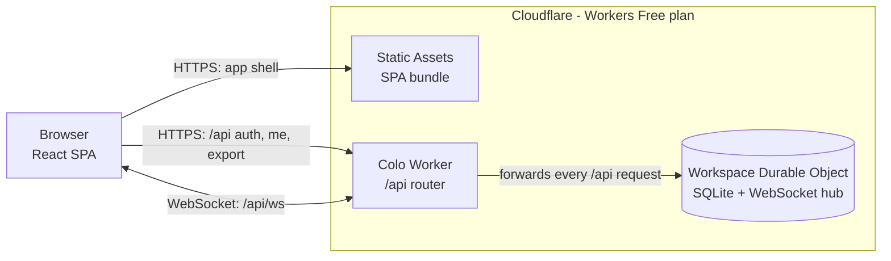

# Colo — Build & Deployment Plan

**Status:** Draft v3
**Date:** 14 September 2026
**Owner:** SWC
**Platform:** Cloudflare Workers (Free plan)
**Scale target:** 1–2 monthly active users (personal project)
**Cost target:** $0/month, hard-capped (no payment method on the account)

---

## 0. Revision history

| Version | Date | Change |
|---|---|---|
| v1 | 13 Sep 2026 | First draft on AWS serverless: S3 + CloudFront, Cognito, AppSync, DynamoDB |
| v2 | 13 Sep 2026 | Corrected AWS Free Tier assumptions; shared-workspace access model; app named Colo (commit `be40456`) |
| v3 | 14 Sep 2026 | **Moved to Cloudflare.** One Durable Object holds all data (SQLite) and the WebSocket hub; invite-only passkey sign-in on `*.workers.dev`. Rationale: [ADR 0001](decisions/0001-move-from-aws-to-cloudflare.md) and [ADR 0002](decisions/0002-passkey-auth-on-workers-dev.md) |

The AWS design is no longer part of this plan; it remains readable in git history at commit `be40456`.

---

## 1. What we are building

**Colo** is a browser-based collaborative notes application. Two people sign in with their own passkeys, see a shared set of notes, and edit them — with changes appearing on the other person's screen in near real time rather than requiring a manual refresh.

The whole thing runs on Cloudflare's Workers Free plan. There is no server, container or database to patch, nothing is billed while idle, and no payment method is attached to the account — so the monthly bill is $0 by construction. The price of that guarantee is that if a daily free limit is ever exceeded, requests fail until the limits reset at 00:00 UTC (05:30 IST) instead of costing money (§9).

### 1.1 In scope (MVP)

| # | Capability | Notes |
|---|---|---|
| F1 | Passkey sign-in, invite-only | No passwords. An admin issues one-time invite links; there is no public registration |
| F2 | List all notes | Sorted by last updated |
| F3 | Create, rename, delete a note | Soft delete (recoverable) |
| F4 | Edit note body and save | Autosave on an 800 ms debounce, plus explicit save |
| F5 | Live propagation of saved changes | Other connected clients update within ~1 s (typically much faster) |
| F6 | Conflict detection | Optimistic concurrency via a `version` column |
| F7 | "Last edited by X at HH:MM" attribution | Cheap trust signal for two-person editing |
| F8 | Works on mobile browser | Responsive layout; passkeys work with phone biometrics |
| F9 | Presence | Who is online and which note they have open — nearly free, because the Durable Object already holds every connection |

### 1.2 Explicitly out of scope (v1)

Rich text formatting beyond Markdown, file/image attachments, folders or tags, full-text search across notes, offline-first sync, sharing with people outside the two-user pool, and a custom domain. Each is a deliberate deferral; see §12.

### 1.3 The one genuinely open design question

"Real time" means two different things:

**Tier A — live propagation on save (planned for v1).** You type, the app autosaves after a pause, and the other person's view updates within about a second. The Durable Object that performs the save immediately pushes the new note to every other open connection.

**Tier B — simultaneous character-level co-editing (deferred to M5).** Google Docs behaviour: both people type in the same sentence at once and neither loses keystrokes. This needs a CRDT — [Yjs](https://github.com/yjs/yjs) is the standard choice. On Cloudflare it fits the existing design without new services: the same Durable Object holds each note's Yjs document, merges updates server-side and persists them to SQLite, and the editor becomes CodeMirror 6 with `y-codemirror.next`.

**Recommendation:** build Tier A, use it for a couple of weeks, and only then decide whether Tier B earns its extra frontend complexity.

---

## 2. Architecture



Everything is served from one hostname, `colo.<subdomain>.workers.dev`, so there is no CORS and the session cookie is first-party.

### 2.1 Component responsibilities

| Component | Responsibility | Why this one |
|---|---|---|
| **Workers Static Assets** | Serves the built SPA (`index.html`, hashed JS/CSS), SPA routing fallback, `_headers` for cache and security headers | Free and unlimited; static requests never invoke the Worker |
| **Colo Worker** | Forwards `/api/*` to the Workspace Durable Object; adds security headers to API responses. Nothing else | Keeping it a ~30-line router means the Free plan's 10 ms CPU limit per invocation never matters |
| **Workspace Durable Object** (one instance, named `default`) | All state in its embedded SQLite: members, passkeys, sessions, invites, notes. Authentication, note operations, WebSocket connections, broadcast, presence | Single-threaded, so a write and its broadcast happen in one serialized step; hibernating WebSockets cost nothing while idle |
| **Workers Logs** | Request and exception logs | Free: 200,000 events/day, 3-day retention |
| **Workers Builds** (M4) | Build and deploy on push to GitHub | Free: 3,000 build minutes/month; no Cloudflare API token stored in GitHub |

### 2.2 Why one Durable Object instead of D1 plus a Durable Object

The obvious Cloudflare design is D1 for storage and a Durable Object only for fanning out updates. Colo instead keeps everything in one Durable Object:

- **One place holds the data.** Durable Objects carry their own SQLite database, so D1 adds nothing but a second service and a second call.
- **No race between saving and broadcasting.** The object processes one event at a time, so `UPDATE … WHERE version = ?` and "send to the other sockets" happen atomically from the clients' point of view.
- **Edits arrive as WebSocket messages.** Incoming WebSocket messages are billed at a 20:1 ratio against Durable Object requests, so autosaves cost a twentieth of what the same number of HTTP requests would.
- **No echo-suppression IDs.** The object knows which socket sent an edit and simply broadcasts to all the others.
- **The Worker stays trivial.** WebAuthn verification and session checks run inside the Durable Object, whose CPU limit is 30 seconds per request rather than 10 ms.
- **Tier B needs no new infrastructure** (§1.3).

The trade-offs, accepted knowingly:

- **Data is only reachable through the object.** There is no `wrangler d1 execute`-style ad-hoc SQL; inspection and backup go through `/api/export` (§4.1).
- **One object lives in one location.** It is placed near its first request; the Worker passes `locationHint: "apac"` so it lands close to both users.
- **Single-threaded throughput** is thousands of simple SQLite operations a second — orders of magnitude more than two people can generate.

Why the login is custom passkeys rather than Cloudflare Access is recorded in [ADR 0002](decisions/0002-passkey-auth-on-workers-dev.md): Worker-level Access does not support WebSocket connections, and hostname-based Access needs a custom domain.

### 2.3 Key request flows

**App load.** Browser requests `https://colo.<subdomain>.workers.dev/` → Static Assets serve `index.html` and bundles without running the Worker → SPA calls `GET /api/me` → `401` shows the sign-in screen; `200` opens the WebSocket.

**Invite (first time for each person).** Admin runs `npm run invite -- --email … --name …` → the script calls `POST /api/admin/invites` with the `ADMIN_TOKEN` secret → the object creates the member if new, stores the SHA-256 hash of a random invite token, and returns `https://colo.<subdomain>.workers.dev/invite#<token>` → admin sends the link privately → the invitee opens it; the SPA reads the token from the URL fragment (never sent to the server in the URL, so never logged) → `POST /api/auth/register/options` → browser creates a passkey (Face ID, fingerprint or device PIN) → `POST /api/auth/register/verify` → the object verifies it, stores the public key, marks the invite used, creates a session and sets the cookie.

**Sign-in.** `POST /api/auth/login/options` returns a challenge with no username (discoverable credentials) → browser shows the passkey prompt → `POST /api/auth/login/verify` → the object finds the credential, verifies the signature, creates a session and sets the cookie.

**Connect.** SPA opens `wss://…/api/ws` → Worker forwards the upgrade → the object checks the `Origin` header and the session cookie → accepts the socket with tags `member:<id>` and `session:<hash-prefix>` and stores `{memberId, sessionExpiresAt}` as the socket attachment → sends `snapshot` (current member, members list, note summaries without bodies) → broadcasts `presence`.

**Editing.** User types; the client debounces 800 ms, then sends `update` with `expectedVersion` → the object runs `UPDATE notes SET …, version = version + 1 WHERE id = ? AND version = ? AND deleted_at IS NULL` → one row changed: `ack` to the sender and `changed` to every other socket → no row changed: `error` with code `CONFLICT` and the current note, and the client shows the conflict banner rather than silently overwriting.

**Receiving.** On `changed`, the list re-sorts. If that note is open with no unsaved local edits, the editor takes the new version; if there are unsaved edits, the conflict banner offers "keep mine" (resend against the new version) or "take theirs".

**Disconnect and reconnect.** The client reconnects with exponential backoff (1 s up to 30 s), receives a fresh `snapshot`, and re-fetches the open note with `get`. Deploys restart the object, so this path is exercised routinely.

**Sign-out and revocation.** `POST /api/auth/logout` deletes the session row and closes that session's sockets via `getWebSockets("session:<hash-prefix>")`. Disabling a member closes all of their sockets via the `member:<id>` tag.

---

## 3. Data model

All data lives in the Workspace Durable Object's embedded SQLite database. There is one workspace (`default`), and every member can read and edit every note — §1.2 rules out sharing beyond the two-person pool, so per-note permissions would be complexity without a use (D7).

### 3.1 Schema

```sql
-- Migration 1 (PRAGMA user_version = 1)
CREATE TABLE members (
  id            TEXT PRIMARY KEY,                -- ULID
  email         TEXT NOT NULL UNIQUE COLLATE NOCASE,
  display_name  TEXT NOT NULL,
  created_at    TEXT NOT NULL,
  disabled_at   TEXT
);

CREATE TABLE passkeys (
  credential_id TEXT PRIMARY KEY,                -- base64url
  member_id     TEXT NOT NULL REFERENCES members(id),
  public_key    BLOB NOT NULL,
  counter       INTEGER NOT NULL DEFAULT 0,
  transports    TEXT,                            -- JSON array
  created_at    TEXT NOT NULL,
  last_used_at  TEXT
);
CREATE INDEX passkeys_by_member ON passkeys(member_id);

CREATE TABLE invites (
  token_hash    TEXT PRIMARY KEY,                -- SHA-256 of the token; the token itself is never stored
  member_id     TEXT NOT NULL REFERENCES members(id),
  expires_at    TEXT NOT NULL,                   -- 24 hours after creation
  used_at       TEXT
);

CREATE TABLE sessions (
  id_hash       TEXT PRIMARY KEY,                -- SHA-256 of the cookie value
  member_id     TEXT NOT NULL REFERENCES members(id),
  created_at    TEXT NOT NULL,
  expires_at    TEXT NOT NULL,                   -- 30 days, sliding
  last_seen_at  TEXT NOT NULL
);

CREATE TABLE auth_challenges (
  id            TEXT PRIMARY KEY,
  challenge     TEXT NOT NULL,
  purpose       TEXT NOT NULL CHECK (purpose IN ('register', 'login')),
  member_id     TEXT,                            -- set for registration
  expires_at    TEXT NOT NULL                    -- 5 minutes after creation
);

CREATE TABLE notes (
  id            TEXT PRIMARY KEY,                -- ULID
  title         TEXT NOT NULL,
  body          TEXT NOT NULL DEFAULT '',
  version       INTEGER NOT NULL DEFAULT 1,
  created_at    TEXT NOT NULL,
  created_by    TEXT NOT NULL REFERENCES members(id),
  updated_at    TEXT NOT NULL,
  updated_by    TEXT NOT NULL REFERENCES members(id),
  deleted_at    TEXT                             -- NULL on live notes
);
CREATE INDEX notes_live_by_updated ON notes(deleted_at, updated_at);
```

Notes on the design:

- **Display names come from a join** (`notes.updated_by → members.display_name`), so renaming a member updates every "last edited by" automatically.
- **Challenges are stored rows**, not signed cookies, so the app needs no signing secret. Expired challenges, invites and sessions are deleted opportunistically during auth calls; no scheduled job is needed.
- **Sessions slide** by extending `expires_at` at most once a day per session, to avoid a write on every request.

### 3.2 Access patterns

| Pattern | Query |
|---|---|
| Authenticate a request | `SELECT … FROM sessions JOIN members … WHERE id_hash = ? AND expires_at > now AND disabled_at IS NULL` |
| List notes, newest first | `SELECT id, title, version, updated_at, updated_by FROM notes WHERE deleted_at IS NULL ORDER BY updated_at DESC` |
| Fetch one note | `SELECT … FROM notes WHERE id = ? AND deleted_at IS NULL` |
| Create note | `INSERT INTO notes …` |
| Update note | `UPDATE notes SET …, version = version + 1 WHERE id = ? AND version = ? AND deleted_at IS NULL` |
| Delete note | `UPDATE notes SET deleted_at = ? WHERE id = ? AND deleted_at IS NULL` |
| Find passkey at login | `SELECT … FROM passkeys WHERE credential_id = ?` |

### 3.3 Migrations

The object's constructor runs pending migrations inside `ctx.blockConcurrencyWhile()`, comparing `PRAGMA user_version` against the list in `src/worker/db.ts`; each migration runs in `ctx.storage.transactionSync()`. Migrations are forward-only and **additive** (new tables, new nullable columns) so that `wrangler rollback` to the previous code version keeps working against a newer schema (§8.5).

### 3.4 Storage and row budget

The Free plan allows 5 GB of Durable Object storage in total and 1 GB per object — thousands of times what two people's text notes need. Every row written counts toward the 100,000 rows/day allowance, and **each index row updated counts as an additional row**. An autosave updates the note row plus the `notes_live_by_updated` index, so roughly 2–3 rows per save; §9 shows the resulting headroom.

---

## 4. API design

The Worker forwards every `/api/*` request to the Workspace Durable Object. Requests use JSON; note operations travel over the WebSocket.

### 4.1 HTTP endpoints

| Method and path | Auth | Purpose |
|---|---|---|
| `GET /api/health` | None | Liveness check (returns object location and schema version) |
| `GET /api/me` | Session | Current member; `401` if not signed in |
| `POST /api/admin/invites` | `Authorization: Bearer <ADMIN_TOKEN>` | Create member (if new) and a one-time invite link. Returns `404` when `ADMIN_TOKEN` is not set |
| `POST /api/auth/register/options` | Invite token in body | WebAuthn creation options + challenge ID |
| `POST /api/auth/register/verify` | Invite token + challenge ID | Store passkey, consume invite, set session cookie |
| `POST /api/auth/login/options` | None | WebAuthn request options + challenge ID |
| `POST /api/auth/login/verify` | Challenge ID | Verify assertion, set session cookie |
| `POST /api/auth/logout` | Session | Delete session, close its sockets, clear cookie |
| `GET /api/export` | Session | Download all notes (including soft-deleted) and member names as JSON |
| `GET /api/ws` | Session | WebSocket upgrade |

Every `POST` and the WebSocket upgrade must carry an `Origin` header equal to the configured `ORIGIN`; anything else is rejected with `403`.

### 4.2 WebSocket protocol

Messages are JSON objects with a `type` field; types are shared between client and server in `src/shared/protocol.ts` and validated on the server.

**Client → server**

| Type | Fields | Result |
|---|---|---|
| `get` | `reqId`, `noteId` | `ack` with the full note, or `error NOT_FOUND` |
| `create` | `reqId`, `title` | `ack` to sender, `changed` to others |
| `update` | `reqId`, `noteId`, `title?`, `body?`, `expectedVersion` | `ack` + `changed`, or `error CONFLICT` with `current` |
| `delete` | `reqId`, `noteId` | `ack` + `changed` (note carries `deletedAt`) |
| `viewing` | `noteId` or `null` | `presence` broadcast |
| `"ping"` (plain text) | — | `"pong"`, answered by the runtime without waking the object |

**Server → client**

| Type | Fields | When |
|---|---|---|
| `snapshot` | `me`, `members`, `notes` (summaries, no bodies) | Immediately after connecting |
| `ack` | `reqId`, `note` | Successful request |
| `error` | `reqId`, `code` (`CONFLICT`, `NOT_FOUND`, `INVALID`, `RATE_LIMITED`, `UNAUTHORIZED`), `current?` | Failed request |
| `changed` | `note`, `byName` | Another socket changed a note |
| `presence` | `online` (member IDs), `viewing` (member ID → note ID) | Connect, disconnect, `viewing` |

### 4.3 Authorization and limits

- **Session on connect, attachment afterwards.** The session is checked when the socket opens. Afterwards the object trusts the socket's attachment until `sessionExpiresAt`, then closes it with code `4001` so the client re-authenticates. Logout and member disabling close sockets immediately (§2.3), so no per-message database read is needed.
- **Rate cap.** Each socket may send at most 20 messages per 10 seconds; excess messages get `error RATE_LIMITED` and are not processed. This bounds the damage of a client bug to a small fraction of the daily free allowance.
- **Size cap.** Note bodies are limited to 512 KB and titles to 200 characters; larger values get `error INVALID`.
- **Hibernation-friendly code.** The object keeps no in-memory timers or intervals, which would prevent hibernation. Rate-limit counters live in the socket attachment; heartbeats use `ctx.setWebSocketAutoResponse()`.

---

## 5. Authentication design

**Passkeys (WebAuthn), invite-only.** Passkeys are phishing-resistant, need no password storage, and verifying one is a cheap signature check. Library: `@simplewebauthn/server` in the Durable Object and `@simplewebauthn/browser` in the SPA.

- **Relying party.** `RP_ID` is the full hostname `colo.<subdomain>.workers.dev`; `ORIGIN` is `https://` plus that. Locally both use `localhost`, which browsers treat as a secure context.
- **Registration options.** Discoverable credential required (enables username-less sign-in), user verification required, attestation `none`, algorithms ES256 and RS256 (Windows Hello uses RS256).
- **Counters.** Many synced passkeys always report a counter of `0`; the server accepts `0` but rejects a counter that goes backwards once it is non-zero.
- **Invites.** 32 random bytes, base64url, delivered in the URL fragment, single use, valid for 24 hours, stored only as a SHA-256 hash.
- **Sessions.** Cookie `__Host-colo_session` holding 32 random bytes; attributes `HttpOnly; Secure; SameSite=Strict; Path=/; Max-Age=2592000`. Only the SHA-256 hash is stored. 30-day sliding expiry.
- **CSRF and cross-site WebSocket hijacking.** `SameSite=Strict` plus the `Origin` check on every `POST` and on the WebSocket upgrade.
- **Admin token.** `ADMIN_TOKEN` is a Worker secret (≥ 32 random bytes) used only to create invites, compared in constant time. After both users are enrolled, delete it (`wrangler secret delete ADMIN_TOKEN`); the invite endpoint then returns `404` until the secret is set again.
- **More devices.** Synced passkeys (iCloud Keychain, Google Password Manager, 1Password and similar) usually cover a person's devices. Otherwise the admin issues a fresh invite for the existing email, which adds another passkey to the same member.
- **Recovery.** Same as adding a device: a new invite for the existing member. Old passkeys can be removed from the member's settings (M4).
- **Runtime check.** SimpleWebAuthn's documentation lists Node 22+ and Deno 2.4+ but not Workers. The first task of M1 is a spike confirming it runs in workerd (with the `nodejs_compat` flag if needed). Fallback: verify ES256/RS256 assertions directly with WebCrypto, which Workers support natively.
- **Hostname-bound passkeys.** Passkeys only work on the hostname they were created for. Moving to a custom domain later (D4) means both users enroll new passkeys through fresh invites — a two-minute job at this scale, but worth knowing before choosing the `workers.dev` subdomain.

---

## 6. Frontend

| Choice | Selection | Rationale |
|---|---|---|
| Framework | React 19 + TypeScript | Well supported; matches Tier B editor bindings |
| Build tool | Vite + `@cloudflare/vite-plugin` | `vite dev` runs the Worker and Durable Object in workerd locally; one package for client and server |
| Auth | `@simplewebauthn/browser` | Passkey prompts across browsers |
| Realtime client | Small WebSocket wrapper (~150 lines) | Reconnect with backoff, `"ping"` every 30 s, request/`ack` matching by `reqId`, resync on reconnect |
| State | React state + a small external store (`useSyncExternalStore`) | No state library needed for one list and one open note |
| Editor (v1) | Controlled `<textarea>` with Markdown preview | Minimal; sufficient for Tier A |
| Markdown | `marked` + `DOMPurify` | Output is always sanitised before rendering |
| Editor (M5) | CodeMirror 6 + `y-codemirror.next` | Only if Tier B is built; suits Markdown better than a rich-text editor |
| Styling | Plain CSS | No build-time dependency needed |

**SPA routing.** `assets.not_found_handling = "single-page-application"` serves `index.html` for unknown paths such as `/invite` or `/notes/<id>`.

**Headers for static assets** come from `public/_headers`:

```
/*
  Content-Security-Policy: default-src 'self'; script-src 'self'; style-src 'self'; img-src 'self' data:; connect-src 'self'; frame-ancestors 'none'; base-uri 'none'; form-action 'self'
  X-Content-Type-Options: nosniff
  Referrer-Policy: same-origin
  Permissions-Policy: camera=(), microphone=(), geolocation=()

/index.html
  Cache-Control: no-cache

/assets/*
  Cache-Control: public, max-age=31536000, immutable
```

`_headers` does not apply to responses generated by Worker code, so the Worker adds the same security headers to `/api` responses itself (except `101` WebSocket upgrades). HTTPS is enforced for the whole `.dev` top-level domain by browsers' HSTS preload list.

---

## 7. Project structure and configuration

**One npm package, no workspaces.** The Vite plugin builds the client and the Worker together.

```
colo/
  package.json              # scripts: dev, build, test, deploy, invite
  wrangler.jsonc
  vite.config.ts
  tsconfig.json
  index.html
  public/
    _headers
  src/
    client/                 # React SPA: main.tsx, App.tsx, ws.ts, auth.ts, editor/
    worker/
      index.ts              # router: /api/* -> Workspace Durable Object
      workspace.ts          # Workspace Durable Object class
      auth.ts               # invites, passkeys, sessions
      notes.ts              # note operations
      db.ts                 # migrations
    shared/
      protocol.ts           # WebSocket message types
  scripts/
    invite.ts               # calls POST /api/admin/invites
  test/                     # vitest + @cloudflare/vitest-pool-workers
  docs/
    colo-plan.md
    decisions/
```

**`wrangler.jsonc` sketch** (confirm key names against the current Wrangler schema during M0):

```jsonc
{
  "$schema": "./node_modules/wrangler/config-schema.json",
  "name": "colo",
  "main": "src/worker/index.ts",
  "compatibility_date": "2026-09-01",
  "workers_dev": true,
  "preview_urls": false,
  "assets": {
    "not_found_handling": "single-page-application",
    "run_worker_first": ["/api/*"]
  },
  "durable_objects": {
    "bindings": [{ "name": "WORKSPACE", "class_name": "Workspace" }]
  },
  "exports": {
    "Workspace": { "type": "durable-object", "storage": "sqlite" }
  },
  "vars": {
    "RP_ID": "colo.<subdomain>.workers.dev",
    "ORIGIN": "https://colo.<subdomain>.workers.dev"
  },
  "observability": { "enabled": true, "head_sampling_rate": 1 }
}
```

- **SQLite storage is mandatory** on the Free plan; key-value-backed Durable Objects are not available.
- **`preview_urls: false`** makes explicit what Cloudflare already does for Workers with Durable Objects.
- Local overrides (`RP_ID=localhost`, `ORIGIN=http://localhost:5173`, a local `ADMIN_TOKEN`) go in `.dev.vars`, which is git-ignored.

**Worker sketch:**

```ts
export { Workspace } from "./workspace";

export default {
  async fetch(request, env) {
    const id = env.WORKSPACE.idFromName("default");
    const stub = env.WORKSPACE.get(id, { locationHint: "apac" });
    const response = await stub.fetch(request);
    return response.webSocket ? response : withSecurityHeaders(response);
  },
} satisfies ExportedHandler<Env>;
```

---

## 8. Deployment

### 8.1 Prerequisites

- A free Cloudflare account. No payment method is needed, and leaving none attached is what guarantees the $0 bill.
- Node.js 22+ (the repo pins 24 in `.nvmrc`). Wrangler is a dev dependency, run via `npx wrangler`.
- A passkey-capable device for each user: any current phone, or a laptop with Touch ID / Windows Hello / a password manager.
- **Choose the account's `workers.dev` subdomain before anyone enrolls a passkey.** The app URL becomes `colo.<subdomain>.workers.dev`, and passkeys are bound to it (§5).

### 8.2 First deployment — ordered steps

```bash
# 1. Install and authenticate
npm ci
npx wrangler login

# 2. Build and deploy the Worker, Durable Object and static assets
npm run deploy                     # vite build && wrangler deploy
curl https://colo.<subdomain>.workers.dev/api/health

# 3. Set the admin secret (keep a copy in your password manager)
openssl rand -base64 32 | npx wrangler secret put ADMIN_TOKEN

# 4. Invite both users; each command prints a one-time link valid for 24 hours
COLO_ADMIN_TOKEN=<token> npm run invite -- --email you@example.com --name "Alex"
COLO_ADMIN_TOKEN=<token> npm run invite -- --email them@example.com --name "Sam"

# 5. After both passkeys are enrolled, disable invites
npx wrangler secret delete ADMIN_TOKEN
```

### 8.3 Routine deploys

`npm run deploy` uploads the Worker, the Durable Object class and the static assets as one new version. Deploying restarts the Durable Object, which closes open WebSockets; clients reconnect and resync automatically (§2.3). Pending schema migrations run when the object restarts.

### 8.4 CI/CD (M4)

Push the repo to a private GitHub repository and connect it with **Workers Builds**: build command `npm ci && npm test && npm run build`, deploy command `npx wrangler deploy`, production branch `main`. The Free plan includes 3,000 build minutes a month with one concurrent build and a 20-minute timeout. Because Cloudflare pulls from GitHub, no Cloudflare API token has to be stored as a GitHub secret.

### 8.5 Rollback and restore

- **Code:** `npx wrangler rollback` returns to the previous version in seconds. Because migrations are additive-only (§3.3), older code keeps working against the newer schema.
- **Data:** the member-only `/api/export` endpoint downloads everything as JSON; take one before risky changes. Durable Object SQLite also offers point-in-time recovery over the last 30 days (`getBookmarkForTime` / `onNextSessionRestoreBookmark`), but Cloudflare's documentation does not state whether it is available on the Free plan — verify during M4 before relying on it.

---

## 9. Cost model

### 9.1 Plan

Colo runs on the **Workers Free plan** with no payment method attached: **$0/month, and no way to be charged.** Free limits are daily and reset at 00:00 UTC. When one is exceeded, further operations of that type fail with errors until the reset — the app goes down, it does not run up a bill.

The only ways money could ever be involved are deliberate: upgrading to Workers Paid (a $5/month minimum) or registering a custom domain (D4).

### 9.2 Free allowances vs. expected use

| Resource | Free allowance | Heavy day for two people |
|---|---|---|
| Static asset requests | Unlimited, free | Any number |
| Worker requests | 100,000/day; 10 ms CPU each | A few hundred (auth calls, `/api/me`, WebSocket upgrades) |
| Durable Object requests | 100,000/day; incoming WebSocket messages count 20:1 | ~5,000 autosaves + ~6,000 heartbeats ≈ 600 billed requests |
| Durable Object duration | 13,000 GB-s/day; hibernated objects are not billed | Under 10,800 GB-s even if the object never hibernated all day |
| SQLite rows read | 5,000,000/day | Tens of thousands at most |
| SQLite rows written | 100,000/day (index rows count) | ~10,000–15,000 |
| SQLite storage | 5 GB total; 1 GB per object | A few MB |
| Workers Logs | 200,000 events/day; 3-day retention | A few thousand |
| Workers Builds (M4) | 3,000 build minutes/month | About a minute per deploy |

The tightest limit is rows written: it would take on the order of 30,000+ autosaves in one day — many hours of continuous typing by both people — to reach it.

### 9.3 Guardrails

1. **Debounce autosave** at 800 ms minimum on the client.
2. **Per-socket rate cap** of 20 messages per 10 seconds on the server (§4.3), so a runaway client cannot exhaust the daily allowances.
3. **Hibernation-friendly Durable Object:** no in-memory timers; heartbeats answered by `setWebSocketAutoResponse()`.
4. **Size caps** on note bodies and titles.
5. **Check the Workers and Durable Objects metrics** in the dashboard monthly. If logs approach 200,000 events/day, lower `head_sampling_rate`.

---

## 10. Security posture

- **Sign-in:** invite-only passkeys — no passwords to steal, phish or stuff. Invite tokens are single use, expire after 24 hours, and are stored only as hashes. The admin secret is removed once both users are enrolled.
- **Sessions:** random 256-bit cookie values stored as hashes, `__Host-` prefixed, `HttpOnly`, `Secure`, `SameSite=Strict`, revocable, and enforced on WebSocket upgrades as well as HTTP calls. `Origin` is checked on every state-changing request and on the upgrade.
- **Surface:** the SPA shell on `workers.dev` is public but contains no data; every note operation requires a session. Preview URLs are disabled.
- **Browser:** strict CSP, `frame-ancestors 'none'`, and sanitised Markdown rendering (`DOMPurify`), so note content cannot inject script.
- **Data:** stored encrypted at rest by Cloudflare inside one Durable Object; backups via `/api/export` (and point-in-time recovery if confirmed on the Free plan).

**Residual risks:**

- **Authentication code is ours.** Mitigated by using SimpleWebAuthn for the cryptography, tests for invites, sessions and revocation, and a focused review in M1.
- **A leaked `ADMIN_TOKEN` would let someone invite themselves.** Mitigated by deleting the secret after enrollment, and by the members list and presence showing any unexpected member.
- **An unlocked device with a synced passkey grants access.** Mitigated by requiring user verification (biometric or device PIN) on every sign-in.

---

## 11. Build plan

| Milestone | Deliverable | Rough effort |
|---|---|---|
| **M0 — Skeleton** | Vite + React + `@cloudflare/vite-plugin`; Worker router; empty Workspace Durable Object answering `/api/health`; `wrangler.jsonc`, `_headers`; deployed to `workers.dev` | Half a day |
| **M1 — Passkey auth** | SimpleWebAuthn-in-workerd spike; auth tables and migrations; invite, register, login, logout; `scripts/invite.ts`; sign-in and invite screens; both users enrolled | 1–1.5 days |
| **M2 — Notes** | Notes table; WebSocket connection with `snapshot`, `get`, `create`, `update`, `delete`; list and editor with autosave; conflict banner | 1 day |
| **M3 — Real time** | `changed` broadcast; presence; heartbeat auto-response; reconnect and resync; per-socket rate cap; "last edited by" | 1 day |
| **M4 — Hardening** | CSP and header check; `/api/export`; confirm Durable Object PITR on Free; session list and passkey removal; private GitHub repo + Workers Builds | Half a day |
| **M5 — Tier B (optional)** | Yjs documents inside the Durable Object; CodeMirror 6 + `y-codemirror.next`; batched updates | 2–3 days, only if M3 proves insufficient |

Ship M0–M4 first and use the app before deciding on M5. The decision gate is concrete: if the two of you repeatedly hit "someone else changed this note" conflicts in real use, Tier B is justified; if not, it is complexity for its own sake.

---

## 12. Open decisions

| # | Decision | Default if undecided |
|---|---|---|
| D1 | Tier B live co-editing — build it? | No; revisit after two weeks of real M3 use |
| D2 | Markdown rendering in the editor | Yes, with sanitised output |
| D3 | Durable Object location | `locationHint: "apac"` on first creation; the object stays where it is created |
| D4 | Custom domain | Deferred. Costs the registry price via Cloudflare Registrar (no markup). Would also allow hostname-based Cloudflare Access as an alternative login ([ADR 0002](decisions/0002-passkey-auth-on-workers-dev.md)); requires re-enrolling passkeys |
| D5 | Note history / revisions | Deferred; a `note_revisions` table in the same object is cheap to add |
| D6 | Automated off-site backups | Deferred; manual `/api/export` in M4, plus PITR if available on Free |
| D7 | Per-note sharing or roles | Deferred; would add a `note_members` table and a per-note check |
| D8 | Trash / restore UI | Deferred; soft-deleted rows stay in the table and appear in `/api/export` |
| D9 | Staging environment | Deferred; a second Worker (`colo-staging`) would get its own Durable Object and data automatically |

---

## 13. Reference — verified service limits

Figures confirmed against Cloudflare documentation in September 2026.

**Workers.** Free: 100,000 requests/day, 10 ms CPU per invocation; exceeding a daily limit makes further operations fail with errors rather than incur charges. Paid: $5/month minimum including 10 million requests and 30 million CPU-ms per month. Static asset requests are free and unlimited on both plans. `_headers` rules do not apply to responses generated by Worker code. Preview URLs are not generated for Workers that implement a Durable Object.

**Durable Objects.** Free plan supports only SQLite-backed objects: 100,000 requests/day, 13,000 GB-s duration/day, 5 million rows read/day, 100,000 rows written/day, 5 GB storage total, 1 GB per object, 100 classes per account. Limits reset at 00:00 UTC. Incoming WebSocket messages are billed at a 20:1 ratio. Objects idle and eligible for hibernation are not billed for duration; `setWebSocketAutoResponse()` replies without waking the object or incurring duration charges. Socket attachments are limited to 16 KiB; received WebSocket messages to 32 MiB; CPU per request defaults to 30 seconds. Each index row updated counts as an additional row written. SQLite point-in-time recovery covers the last 30 days (Free-plan availability not stated).

**Workers Logs.** Free: 200,000 log events/day with 3-day retention. Paid: 20 million events/month included, 7-day retention.

**Workers Builds.** Free: 3,000 build minutes/month, one concurrent build, 20-minute timeout.

**Cloudflare Access (for ADR 0002).** Worker-level Access policies do not currently support WebSocket connections; `ctx.access` is not passed to Workers that serve Static Assets. Zero Trust's free plan covers up to 50 users.

---

## Sources

- [Cloudflare Workers pricing](https://developers.cloudflare.com/workers/platform/pricing/)
- [Durable Objects pricing](https://developers.cloudflare.com/durable-objects/platform/pricing/)
- [Durable Objects limits](https://developers.cloudflare.com/durable-objects/platform/limits/)
- [Durable Objects SQLite storage API](https://developers.cloudflare.com/durable-objects/api/sqlite-storage-api/)
- [Durable Objects state API (WebSockets, auto-response)](https://developers.cloudflare.com/durable-objects/api/state/)
- [Durable Objects WebSocket best practices](https://developers.cloudflare.com/durable-objects/best-practices/websockets/)
- [Durable Objects migrations and exports](https://developers.cloudflare.com/durable-objects/reference/durable-objects-migrations/)
- [Workers Static Assets headers](https://developers.cloudflare.com/workers/static-assets/headers/)
- [Workers preview URLs](https://developers.cloudflare.com/workers/configuration/previews/)
- [Workers Logs](https://developers.cloudflare.com/workers/observability/logs/workers-logs/)
- [Workers Builds limits and pricing](https://developers.cloudflare.com/workers/ci-cd/builds/limits-and-pricing/)
- [Cloudflare Access for Workers](https://developers.cloudflare.com/workers/configuration/cloudflare-access/)
- [Cloudflare Registrar](https://www.cloudflare.com/products/registrar/)
- [SimpleWebAuthn server](https://simplewebauthn.dev/docs/packages/server)
