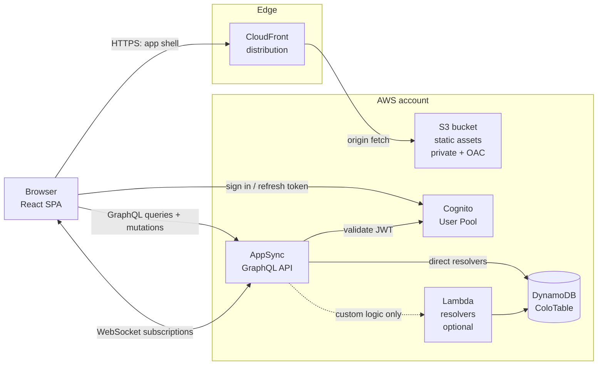

# Colo — Build & Deployment Plan

**Status:** Draft v2
**Date:** 13 September 2026
**Owner:** SWC
**Scale target:** 1–2 monthly active users (personal project)
**Cost target:** under $0.25/month steady state ($0 while new-account credits last)

---

## 1. What we are building

**Colo** is a browser-based collaborative notes application. Two people sign in with their own accounts, see a shared set of notes, and edit them — with changes appearing on the other person's screen in near real time rather than requiring a manual refresh.

The whole thing is serverless. There is no EC2 instance, no container, no database server to patch, and nothing that costs money while idle. Every component except S3 and AppSync is chosen so that at this usage level it sits inside an AWS *always-free* allowance. S3 and AppSync have no free allowance this project can rely on — whatever the account's age — and cost a few cents a month instead (§9.1).

### 1.1 In scope (MVP)

| # | Capability | Notes |
|---|---|---|
| F1 | Email + password sign-in | Invite-only; no public self-registration |
| F2 | List all notes the user has access to | Sorted by last updated |
| F3 | Create, rename, delete a note | Soft delete preferred (recoverable) |
| F4 | Edit note body and save | Autosave on a debounce, plus explicit save |
| F5 | Live propagation of saved changes | Other connected clients update within ~1s |
| F6 | Conflict detection | Optimistic concurrency via a `version` field |
| F7 | "Last edited by X at HH:MM" attribution | Cheap trust signal for two-person editing |
| F8 | Works on mobile browser | Responsive layout; no native app |

### 1.2 Explicitly out of scope (v1)

Rich text formatting beyond Markdown, file/image attachments, folders or tags, full-text search across notes, offline-first sync, note sharing with people outside the two-user pool, and a custom domain. Each of these is a deliberate deferral, not an oversight — they are listed again in §11 as candidate follow-ons.

### 1.3 The one genuinely open design question

"Real time" means two different things and they cost very different amounts of effort:

**Tier A — live propagation on save (planned for v1).** You type, the app autosaves after a pause, and within about a second the other person's view updates. This is a solved problem: an AppSync subscription pushes the new note state to every subscribed client. Simple, robust, and adequate for two people who are mostly *not* typing in the same paragraph at the same instant.

**Tier B — simultaneous character-level co-editing (deferred to Phase 4).** Google Docs behaviour: both people type in the same sentence at once and neither loses keystrokes. AWS gives you the *transport* for this but not the *merge logic*. Concurrent edits to the same text need a CRDT — [Yjs](https://github.com/yjs/yjs) is the standard choice — layered onto the frontend, with AppSync carrying the binary update deltas. This roughly doubles the frontend complexity and is worth doing only if Tier A proves genuinely annoying in practice.

**Recommendation:** build Tier A, use it for a few weeks, and only then decide whether Tier B earns its complexity. The architecture below does not need to change to add Tier B later — it adds a mutation and a subscription, not a new service.

---

## 2. Architecture



### 2.1 Component responsibilities

| Component | Responsibility | Why this one |
|---|---|---|
| **S3** | Stores the built static assets: `index.html`, JS/CSS bundles, icons | Cheapest possible static host; bucket stays private |
| **CloudFront** | Public HTTPS entry point, TLS, caching, SPA routing fallback | Always-free tier is generous; gives HTTPS on the default `*.cloudfront.net` domain with zero certificate work |
| **Cognito User Pool** | User directory, sign-in, password reset, JWT issuance | Removes all credential-handling code; perpetual free tier to 10,000 MAU |
| **AppSync** | GraphQL API, authorization, and — critically — managed WebSocket subscriptions | Managed real-time without writing connection-tracking code; native Cognito authorizer |
| **DynamoDB** | Note storage and access-control records | Always-free 25 GB + 25 RCU/WCU; single-digit-ms reads |
| **Lambda** | Only for logic DynamoDB resolvers can't express | Always-free tier; kept out of the hot path where possible |

### 2.2 Why AppSync rather than API Gateway WebSocket + Lambda

Both can deliver real-time. The raw route (API Gateway WebSocket API + a Lambda that tracks connection IDs in DynamoDB and fans out messages) means writing and owning `$connect`/`$disconnect`/`$default` handlers, a connections table, stale-connection cleanup, and the fan-out loop. AppSync does all of that internally: you declare a subscription in the schema, tag it to a mutation, and connected clients receive the payload.

The trade-off is that AppSync has no always-free allowance, so it is billed from the first request (§9.1). At the traffic level in §9 that costs about ten cents a month, which does not justify maintaining several hundred lines of connection-management code.

### 2.3 Key request flows

**App load.** Browser requests `https://dxxxx.cloudfront.net/` → CloudFront serves `index.html` from S3 (or its cache) → SPA boots, checks for a valid Cognito session in storage → if absent, renders the sign-in screen; if present, opens the AppSync client with the ID token.

**Sign-in.** SPA calls Cognito directly over HTTPS (SRP flow, no client secret) → Cognito returns ID, access, and refresh tokens → SPA stores them and attaches the ID token to every AppSync call. The refresh token silently renews the short-lived tokens in the background. The SPA then calls `me` to load the user's display name; a Cognito user with no Member item gets `Unauthorized` and sees a "no access" screen.

**Loading notes.** SPA issues `listNotes` → AppSync validates the JWT against the User Pool, extracts `sub` (the user's stable identifier) → the resolver confirms a Member item exists for that `sub` → queries GSI1 for the workspace's live notes, newest first → returns the list.

**Editing.** User types; frontend debounces ~800 ms, then fires `updateNote` carrying `expectedVersion` and the tab's `originId` → the resolver checks membership, then performs a conditional write (`version = :expectedVersion` and the note is not deleted) → on success, version increments and DynamoDB returns the new item → AppSync publishes it to everyone subscribed to that note and to the note list → their editors and lists reconcile. On condition failure the client refetches and surfaces a conflict rather than silently overwriting.

**Real-time receive.** Each open note holds an `onNoteChanged(noteId:)` subscription over WebSocket, and the note list holds `onNoteListChanged`; both are membership-checked when they open. Each browser tab generates an `originId` once (`crypto.randomUUID()`) and sends it with every mutation. The resolver stores it on the note, so every payload carries the `originId` of the tab that made the change, and a tab ignores payloads carrying its own — you never fight your own echo.

---

## 3. Data model

A single DynamoDB table, `ColoTable`, holding two item types: members and notes. Single-table design here is not about scale — it keeps everything inside one table's provisioned capacity so the free tier covers it.

**Access model: one shared workspace.** §1.2 rules out sharing with anyone outside the two-user pool, so every note is visible to, and editable by, every member. Permission therefore lives at workspace level: a user may act on any note if and only if a Member item exists for their Cognito `sub`. There are no per-note membership records. v1 has exactly one workspace, `default`; resolvers receive its ID as an AppSync environment variable rather than hardcoding it. Per-note sharing can be added later (D7).

### 3.1 Key schema

| Attribute | Role |
|---|---|
| `PK` (partition key) | `WS#<workspaceId>` for members, `NOTE#<noteId>` for notes |
| `SK` (sort key) | `MEMBER#<cognitoSub>` for members, `META` for notes |
| `GSI1PK` | `WS#<workspaceId>#NOTES` on live notes only; removed on soft delete, so GSI1 is a sparse index of live notes |
| `GSI1SK` | `<updatedAt>#<noteId>` — orders the list by last edit |

### 3.2 Item shapes

**Member item** — one per person allowed into the workspace. The admin seed script (§8.2) writes it right after creating the Cognito user; its presence *is* the permission.

```json
{
  "PK":          "WS#default",
  "SK":          "MEMBER#e4f1a2c0-...",
  "type":        "Member",
  "sub":         "e4f1a2c0-...",
  "email":       "you@example.com",
  "displayName": "Alex",
  "addedAt":     "2026-09-13T09:05:10Z"
}
```

**Note item** — the note itself.

```json
{
  "PK":            "NOTE#01J8XK2M4A",
  "SK":            "META",
  "GSI1PK":        "WS#default#NOTES",
  "GSI1SK":        "2026-09-13T11:31:02Z#01J8XK2M4A",
  "type":          "Note",
  "noteId":        "01J8XK2M4A",
  "workspaceId":   "default",
  "title":         "Groceries",
  "body":          "milk\neggs\n...",
  "version":       7,
  "createdAt":     "2026-09-13T09:12:44Z",
  "createdBy":     "e4f1a2c0-...",
  "updatedAt":     "2026-09-13T11:31:02Z",
  "updatedBy":     "9b7d3e11-...",
  "updatedByName": "Sam",
  "lastOriginId":  "5f0c8a4e-..."
}
```

- `deletedAt` is **absent** on live notes rather than `null`, so conditions can use `attribute_not_exists(deletedAt)`.
- `updatedByName` is copied from the editor's Member item at write time, so "last edited by" (F7) needs no extra lookup. If someone changes their display name, older notes keep the old one.
- `lastOriginId` identifies the browser tab that made the last write, for echo suppression (§2.3). The API exposes it as `Note.originId`.

### 3.3 Access patterns

| Pattern | Operation |
|---|---|
| Authorize caller | `GetItem PK = WS#<ws>, SK = MEMBER#<sub>` — first step of every resolver; also yields `displayName` |
| List notes, newest first | `Query GSI1 where GSI1PK = WS#<ws>#NOTES`, `ScanIndexForward = false` |
| Fetch one note | `GetItem PK = NOTE#<id>, SK = META`; return `null` if `deletedAt` is set |
| Create note | `PutItem` with `ConditionExpression: attribute_not_exists(PK)` |
| Update note | `UpdateItem` with `ConditionExpression: version = :expected AND attribute_not_exists(deletedAt)`; also refreshes `GSI1SK` |
| Delete note | `UpdateItem` setting `deletedAt` and `REMOVE GSI1PK` — the note leaves the list index but the item stays for recovery |

GSI1 is eventually consistent, so a note created or edited a moment ago can be missing from, or out of order in, an immediate `listNotes`. The list subscription (§4.1) delivers the change directly, so the UI does not depend on the index catching up.

### 3.4 Capacity mode — important for staying free

The always-free DynamoDB allowance is **25 GB of storage plus 25 write capacity units and 25 read capacity units**, and those WCU/RCU figures apply to **provisioned** capacity mode. On-demand mode is billed per request from the first request (storage still falls under the free 25 GB).

At two users the per-request cost of on-demand would be trivially small, but since provisioned mode is free and the traffic is utterly predictable, configure the table as:

- Table: 5 RCU / 5 WCU provisioned, no auto-scaling (or auto-scaling capped at 10)
- GSI1: 5 RCU / 5 WCU — **GSI capacity is charged separately and counts toward the same 25**, bringing the total to 10 RCU / 10 WCU

That leaves comfortable headroom under the free allowance. Enable point-in-time recovery (PITR) for backup; note that PITR is billed on storage size and is *not* in the free tier, though at a few MB of notes it rounds to roughly a cent a month.

---

## 4. API design (AppSync GraphQL)

### 4.1 Schema

```graphql
type Member {
  sub: ID!
  displayName: String!
  email: AWSEmail!
}

type Note {
  noteId: ID!
  workspaceId: ID!
  title: String!
  body: String!
  version: Int!
  createdAt: AWSDateTime!
  createdBy: ID!
  updatedAt: AWSDateTime!
  updatedBy: ID!
  updatedByName: String!
  originId: ID              # tab that made the last write (stored as lastOriginId)
  deletedAt: AWSDateTime    # set only on soft-deleted notes
}

type Query {
  me: Member!
  listNotes(limit: Int = 50, nextToken: String): NoteConnection!
  getNote(noteId: ID!): Note
}

type Mutation {
  createNote(title: String!, body: String = "", originId: ID!): Note!
  updateNote(
    noteId: ID!
    title: String
    body: String
    expectedVersion: Int!
    originId: ID!
  ): Note!
  deleteNote(noteId: ID!, originId: ID!): Note!
}

type Subscription {
  onNoteChanged(noteId: ID!): Note
    @aws_subscribe(mutations: ["updateNote", "deleteNote"])
  onNoteListChanged: Note
    @aws_subscribe(mutations: ["createNote", "updateNote", "deleteNote"])
}

type NoteConnection {
  items: [Note!]!
  nextToken: String
}
```

- **Subscribers only receive fields the triggering mutation selected.** The client therefore uses one shared `NoteFields` fragment — including `originId`, `updatedByName` and `deletedAt` — on every mutation, query and subscription.
- `onNoteListChanged` also fires on `updateNote`, so the other person's list re-sorts when a note is edited.
- `deleteNote` returns the note with `deletedAt` set, so subscribers can tell a delete from an edit.

### 4.2 Authorization

Default authorization mode: **Amazon Cognito User Pools**. Every field requires a valid ID token; there is no API-key or IAM path exposed publicly. AppSync validates the JWT signature and expiry against the User Pool before a resolver ever runs, so unauthenticated traffic is rejected at the API boundary at no compute cost.

A valid token is not enough: every operation also requires **workspace membership**, enforced inside pipeline resolvers rather than trusted from the client.

- **Queries and mutations** are two-step pipelines. A shared `requireMember` function reads `WS#<WORKSPACE_ID> / MEMBER#<ctx.identity.sub>`. It fails with `Unauthorized` if the item is missing, and otherwise puts the member in `ctx.stash` for the second step, which performs the operation. A Cognito user without a Member item can sign in but cannot read or write anything.
- **Subscriptions** get a resolver that runs when a client subscribes, using the same `requireMember` check. Without it, any signed-in user could subscribe to any `noteId`, because by default AppSync checks only the token for subscriptions.
- **Conflicts:** when `updateNote`'s condition fails, the resolver returns error type `ConflictError`; the client refetches the note and shows the conflict banner instead of overwriting.

### 4.3 Resolver strategy

Prefer **direct DynamoDB resolvers** (AppSync JavaScript resolvers) for all six queries and mutations and both subscription checks — no Lambda in the hot path, which means no cold starts on the critical read path and no Lambda invocations counted at all. The table name and workspace ID reach resolvers as AppSync environment variables. Reach for a Lambda resolver only if something genuinely needs it, for example a future "merge two notes" operation or an export-to-file job.

### 4.4 Phase 4 addition (only if Tier B co-editing is built)

```graphql
type EditDelta {
  noteId: ID!
  update: String!      # base64-encoded Yjs binary update
  originId: ID!
  sentAt: AWSDateTime!
}

type Mutation {
  publishDelta(noteId: ID!, update: String!, originId: ID!): EditDelta!
}

type Subscription {
  onDelta(noteId: ID!): EditDelta @aws_subscribe(mutations: ["publishDelta"])
}
```

Both new fields use the same `requireMember` check as everything else. Deltas are ephemeral broadcast traffic and need not be persisted; the debounced `updateNote` continues to write the authoritative snapshot to DynamoDB. Two caveats to validate before committing to this design: AppSync caps subscription payload size, so large pastes must be chunked or routed through an S3 side-channel, and per-keystroke mutations would multiply the operation count — batch deltas on a short timer (~200 ms) rather than sending one per keypress.

---

## 5. Authentication design

**User Pool configuration**

- Sign-in alias: email. Case-insensitive.
- **Self-registration disabled.** Both accounts are created by admin action — this is the single most effective control for a two-person app on a public URL.
- Password policy: minimum 12 characters, no forced rotation, no composition rules beyond length (aligned with current NIST guidance).
- MFA: optional TOTP, strongly recommended for the owner account.
- Account recovery: email only.
- Advanced security features: leave off — they are billed per MAU above the base tier and add nothing at two users.

**App client**

- Public client, **no client secret** (a secret cannot be kept secret in a browser bundle).
- Auth flow: `ALLOW_USER_SRP_AUTH` + `ALLOW_REFRESH_TOKEN_AUTH`. Explicitly disable `ALLOW_USER_PASSWORD_AUTH`.
- Token validity: ID and access tokens 1 hour; refresh token 30 days.
- Token storage: in-memory plus `localStorage` for the refresh token, which is the standard Amplify behaviour and an acceptable trade-off for a personal tool. Anyone wanting stricter handling should note that eliminating `localStorage` entirely requires a backend-for-frontend with httpOnly cookies — disproportionate here.

**Frontend integration:** AWS Amplify's auth library, which handles the SRP handshake, token refresh, and the hosted-UI-free custom sign-in form. Total integration surface is roughly 60 lines.

---

## 6. Frontend

| Choice | Selection | Rationale |
|---|---|---|
| Framework | React 19 + TypeScript | Best-supported path for both Amplify and Yjs bindings |
| Build tool | Vite | Fast builds, trivial static output |
| Auth SDK | `aws-amplify/auth` | Handles SRP + refresh |
| API client | `aws-amplify/api` (GraphQL) | Built-in subscription handling over AppSync's WebSocket protocol |
| Editor (v1) | Controlled `<textarea>` with Markdown preview | Minimal; sufficient for Tier A |
| Editor (Phase 4) | Tiptap/ProseMirror + `y-prosemirror` | Only if Tier B co-editing is built |
| Styling | Plain CSS or Tailwind | Either; no strong constraint |

**SPA routing on CloudFront.** A client-routed app breaks on refresh unless CloudFront is told to serve `index.html` for unknown paths. Configure custom error responses mapping both **403** (S3's response for a missing key behind OAC) and **404** to `/index.html` with HTTP status **200**.

**Cache strategy.** Vite emits content-hashed filenames, so:
- `index.html` → `Cache-Control: no-cache` (always revalidate)
- `/assets/*` → `Cache-Control: public, max-age=31536000, immutable`

With that split, a deploy only needs an invalidation of `/index.html`, keeping invalidation counts well inside the free allowance.

---

## 7. Infrastructure as code

**Tooling: AWS CDK v2 (TypeScript).** The alternatives are worth naming: SAM is lighter but weaker at wiring AppSync and Cognito together; Terraform is excellent but adds a state backend to manage; the Amplify CLI is fastest to start but generates infrastructure that is awkward to customise later. CDK keeps the whole stack in the same language as the frontend and produces plain CloudFormation.

Everything lives in **one stack** — at this size, splitting into separate stacks buys nothing and costs cross-stack reference headaches.

```
colo/
  package.json            # npm workspaces: infra, web
  docs/colo-plan.md
  scripts/
    add-member.ts         # admin: create Cognito user + Member item
  infra/
    bin/app.ts
    lib/
      colo-stack.ts       # the single stack
      constructs/
        auth.ts           # Cognito user pool + app client
        data.ts           # DynamoDB table + GSI1
        api.ts            # AppSync API, schema, resolvers
        web.ts            # S3 bucket, OAC, CloudFront distribution
    graphql/
      schema.graphql
      resolvers/*.js      # AppSync JS resolvers (requireMember + one per operation)
  web/                    # Vite + React SPA
```

Illustrative sketch of the web construct:

```ts
const bucket = new s3.Bucket(this, 'SiteBucket', {
  blockPublicAccess: s3.BlockPublicAccess.BLOCK_ALL,
  encryption: s3.BucketEncryption.S3_MANAGED,
  enforceSSL: true,
  removalPolicy: RemovalPolicy.RETAIN,
});

const distribution = new cloudfront.Distribution(this, 'Cdn', {
  defaultRootObject: 'index.html',
  defaultBehavior: {
    origin: origins.S3BucketOrigin.withOriginAccessControl(bucket),
    viewerProtocolPolicy: cloudfront.ViewerProtocolPolicy.REDIRECT_TO_HTTPS,
    cachePolicy: cloudfront.CachePolicy.CACHING_OPTIMIZED,
    responseHeadersPolicy:
      cloudfront.ResponseHeadersPolicy.SECURITY_HEADERS,
  },
  errorResponses: [
    { httpStatus: 403, responseHttpStatus: 200, responsePagePath: '/index.html' },
    { httpStatus: 404, responseHttpStatus: 200, responsePagePath: '/index.html' },
  ],
});
```

**Required stack outputs** — these are what the frontend build consumes:

| Output | Consumed by |
|---|---|
| `UserPoolId`, `UserPoolClientId` | Amplify auth config |
| `GraphQlApiUrl`, `GraphQlRealtimeUrl` | Amplify API config |
| `DistributionDomainName` | The app's URL |
| `SiteBucketName`, `DistributionId` | Deploy script (sync + invalidate) |
| `AwsRegion` | Both |

---

## 8. Deployment

### 8.1 Prerequisites

AWS account with admin credentials configured locally as a named CLI profile, AWS CLI v2, and Node.js 22+ (Node 20 reached end of life in April 2026). AWS CDK v2 is a dev dependency of `infra/` and runs via `npx cdk`, so no global install is needed. One-time per account/region: `cdk bootstrap aws://<account-id>/<region>`.

**Account plan.** If the AWS account was created on or after 15 July 2025, it must be on the **Paid plan**, not the Free plan. A Free plan account closes automatically six months after it is opened, or sooner if its credits run out; AWS then deletes its resources after 90 days unless it is upgraded. That is fatal for an app meant to run indefinitely. Upgrading keeps any unused credits, and the always-free allowances in §9.1 apply on both plans. Accounts created before that date are on the legacy free tier and need no plan change.

Pick a single region and stay in it — `ap-south-1` (Mumbai) is the sensible default given the user location; CloudFront is global regardless, so the region choice only affects API and database latency.

### 8.2 First deployment — ordered steps

```bash
# 1. Install dependencies (npm workspaces) and provision all infrastructure
npm ci
cd infra
npx cdk deploy ColoStack --outputs-file ../web/src/aws-outputs.json
cd ..

# 2. Create the two users and add them to the workspace (invite-only, admin-driven).
#    The script runs cognito-idp admin-create-user (Cognito emails a temporary
#    password), reads the new user's sub, and writes the WS#default / MEMBER#<sub> item.
npx tsx scripts/add-member.ts --email you@example.com --name "Alex"
# repeat for the second user

# 3. Build the frontend against the real stack outputs
cd web
npm run build

# 4. Publish static assets
aws s3 sync dist/ s3://<SiteBucketName>/ --delete \
  --cache-control "public,max-age=31536000,immutable" \
  --exclude index.html
aws s3 cp dist/index.html s3://<SiteBucketName>/index.html \
  --cache-control "no-cache"

# 5. Invalidate the HTML entry point only
aws cloudfront create-invalidation \
  --distribution-id <DistributionId> --paths "/index.html"
```

The app is then live at `https://<DistributionDomainName>/`. Initial CloudFront propagation takes a few minutes on first creation.

### 8.3 Routine deploys

Infrastructure changes: `cdk deploy`. Frontend-only changes: steps 3–5 above, wrapped in an `npm run deploy` script. Because assets are content-hashed, a frontend deploy is effectively atomic — new bundles upload first, and the `index.html` swap is what flips users to the new version.

### 8.4 CI/CD (recommended, not required for v1)

GitHub Actions on push to `main`, authenticating via **OIDC** so no long-lived AWS access keys are ever stored in GitHub:

```yaml
permissions:
  id-token: write
  contents: read

steps:
  - uses: actions/checkout@v4
  - uses: actions/setup-node@v4
    with: { node-version: 24, cache: npm }
  - uses: aws-actions/configure-aws-credentials@v4
    with:
      role-to-assume: arn:aws:iam::<account-id>:role/GitHubDeployRole
      aws-region: ap-south-1
  - run: npm ci && npm run build --workspace web
  - run: npm run deploy --workspace web
```

The IAM role trusts GitHub's OIDC provider, scoped to this specific repository and the `main` branch, with permissions limited to CDK deployment plus `s3:PutObject` on the site bucket and `cloudfront:CreateInvalidation` on the one distribution.

### 8.5 Rollback

Frontend: re-sync the previous build output and invalidate — under a minute. Infrastructure: `cdk deploy` from the previous commit, or CloudFormation's automatic rollback on a failed update. Data: PITR restore to a timestamp, which creates a new table that then needs swapping in — slow and manual, but this is a notes app for two people, not a payments system.

---

## 9. Cost model

### 9.1 Free tier status per service

Four of the six services have always-free allowances that apply to every AWS account, whatever its age or plan. S3 and AppSync do not, and in practice they are billed from day one:

| Account created | S3 and AppSync |
|---|---|
| **Before 15 July 2025** (legacy free tier) | They had a 12-month trial allowance counted from account creation. Every such trial ended by 15 July 2026 at the latest, so these accounts pay §9.2 rates now. |
| **On or after 15 July 2025** (credit-based free tier) | The 12-month trials do not exist. Usage is billed at standard rates and deducted from the $100–$200 sign-up credits. Credits expire 12 months after account creation; after that, §9.2 rates apply. |

Either way, the realistic cost is the few cents a month in §9.2 — it is just not $0.

| Service | Free allowance | Type | Expected use at 2 users |
|---|---|---|---|
| CloudFront | 1 TB data out + 10,000,000 requests/mo | **Always free** | A few hundred requests, well under 1 GB |
| DynamoDB | 25 GB + 25 WCU + 25 RCU | **Always free** | <10 MB, <5 WCU/RCU |
| Cognito | 10,000 MAU (Essentials/Lite) | **Always free** (explicitly does not expire at 12 months) | 2 MAU |
| Lambda | 1,000,000 requests + 400,000 GB-s/mo | **Always free** | Near zero — resolvers are direct to DynamoDB |
| S3 | None usable (see above) | **Billed** — credit-covered on new accounts | ~5 MB of bundles; ~$0.01/mo |
| AppSync | None usable (see above) | **Billed** — credit-covered on new accounts | Hundreds of ops; a few thousand connection-minutes |

### 9.2 What S3 and AppSync actually cost

These rates apply from the first deploy (offset by credits on a new account). AppSync's pay-as-you-go rates are $4.00 per million operations, $2.00 per million real-time updates, and $0.08 per million connection-minutes. Even a deliberately pessimistic month — say 20,000 operations, 20,000 real-time updates, and 10,000 connection-minutes — works out to roughly **$0.12**. S3 at this size lands near **$0.01**. Everything else stays $0 because those allowances never expire.

**Realistic steady-state cost: $0.00–0.25/month** — $0 on a new account until its credits are used up or expire. The one thing that could change that picture is a mistake rather than growth — an accidental infinite subscription loop, a runaway autosave firing per keystroke, or leaving a debug script running. Hence §9.3.

### 9.3 Cost guardrails (do these on day one)

1. **AWS Budgets alert at $1/month**, emailing on both actual and forecast breach. Two budget alerts are free. On a new account, **exclude credits** from the budget (and from any cost you review). Otherwise credits net the bill to $0, and a runaway stays invisible until the credits are gone.
2. **Cost Anomaly Detection** enabled — free, and catches the shape of a runaway before the total looks alarming.
3. **Debounce autosave** at 800 ms minimum and batch any Phase 4 deltas — the single largest realistic driver of AppSync operation count. Each `updateNote` publishes to both subscriptions, so autosave frequency drives real-time updates twice over.
4. **CloudWatch log retention set to 7 days** on every log group. Default retention is "never expire", and accumulated logs are one of the few line items that quietly grows forever. The always-free CloudWatch allowance covers 5 GB of ingestion, but there is no reason to spend it.

---

## 10. Security posture

The S3 bucket is fully private with public access blocked; CloudFront reaches it through Origin Access Control, so there is no public bucket URL to leak. All traffic is HTTPS-only, with HTTP redirected, and CloudFront's managed `SECURITY_HEADERS` policy supplies HSTS, `X-Content-Type-Options`, frame options, and a referrer policy.

The API is closed by default — Cognito User Pool authorization on every field, self-registration disabled so the user pool cannot be joined by a stranger, and workspace-membership authorization enforced inside pipeline resolvers — including when a subscription opens — rather than trusted from the client. No IAM user access keys exist anywhere in the deployment path; local deploys use a named CLI profile and CI uses OIDC role assumption.

Data is encrypted at rest by default in both S3 (SSE-S3) and DynamoDB (AWS-owned keys), which is adequate here; a customer-managed KMS key would add cost without a matching threat. PITR covers accidental deletion. The realistic residual risks are credential compromise of one of the two accounts — mitigated by the 12-character minimum and optional TOTP — and XSS in the note renderer, which is why any Markdown rendering must sanitise output (`dompurify` or a renderer with HTML disabled) rather than dangerously setting inner HTML.

---

## 11. Build plan

| Milestone | Deliverable | Rough effort |
|---|---|---|
| **M0 — Skeleton** | Repo, CDK app, empty stack deploying cleanly; Vite app serving "hello" through CloudFront | Half a day |
| **M1 — Auth** | Cognito pool, `add-member` script, both users created and added as workspace members, sign-in/sign-out working, protected route shell | Half a day |
| **M2 — CRUD** | DynamoDB table + GSI1, AppSync schema, `requireMember` pipeline resolvers, list/create/edit/delete notes with autosave and optimistic concurrency | 1–2 days |
| **M3 — Real time (Tier A)** | Both subscriptions wired with subscribe-time membership checks, echo suppression via `originId`, "last edited by" display, conflict banner on version mismatch | Half a day |
| **M4 — Hardening** | Budget alerts, log retention, PITR, security headers verified, GitHub Actions OIDC pipeline | Half a day |
| **M5 — Tier B (optional)** | Yjs + Tiptap, delta mutation/subscription, presence indicators | 2–3 days, only if M3 proves insufficient |

Ship M0–M4 first and use the app before deciding on M5. The decision gate is concrete: if you and your collaborator repeatedly hit "someone else changed this note" conflicts during real use, Tier B is justified; if not, it is complexity for its own sake.

---

## 12. Open decisions

| # | Decision | Default if undecided |
|---|---|---|
| D1 | Tier B live co-editing — build it? | No; revisit after two weeks of real M3 use |
| D2 | Markdown rendering in the editor | Yes, with sanitised output |
| D3 | Region | `ap-south-1` |
| D4 | Custom domain later | Deferred; ~$12/yr domain + ~$0.50/mo hosted zone when wanted |
| D5 | Note history / revisions | Deferred; the schema's `version` field leaves room to add an append-only revision item later |
| D6 | Export / backup to file | Deferred; PITR covers disaster recovery in the meantime |
| D7 | Per-note sharing or roles | Deferred; v1 shares every note with every workspace member. If needed, add `USER#<sub> / NOTE#<id>` membership items and a per-note check after `requireMember` |
| D8 | Trash / restore UI for deleted notes | Deferred; soft-deleted items stay in the table, and an admin can restore one by removing `deletedAt` and re-adding `GSI1PK` |

---

## 13. Reference — verified service limits

Figures confirmed against AWS documentation in September 2026.

**Lambda:** 15-minute (900 s) maximum timeout for standard invocations, 90 minutes for Managed Instances; memory 128 MB–10,240 MB with CPU scaling proportionally (≈1 vCPU at 1,769 MB); `/tmp` 512 MB–10,240 MB; deployment package 50 MB zipped / 250 MB unzipped / 10 GB as a container image; 6 MB synchronous payload; 1,000 concurrent executions per region by default. Cold starts affect well under 1% of invocations in steady traffic and typically range from under 100 ms to just over a second — largely irrelevant to this design, since AppSync resolves directly to DynamoDB without Lambda in the request path.

**AWS Free Tier structure (post-July 2025):** Accounts created on or after 15 July 2025 receive $100 in sign-up credits and can earn up to $100 more by completing activities. Credits expire 12 months after account creation. At sign-up the account chooses one of two plans. The **Free plan** covers select services only and never charges; it closes automatically after six months or when the credits are used up, whichever comes first, and resources are deleted 90 days later unless the account upgrades. The **Paid plan** covers all services and bills usage beyond the credits at standard rates. These accounts get no 12-month trial allowances; those remain only for accounts created before 15 July 2025, and every such trial had expired by July 2026. Separately, 30+ services carry always-free monthly allowances on both plans, which is the category this architecture targets for everything except S3 and AppSync.

---

## Sources

- [AWS Free Tier](https://aws.amazon.com/free/)
- [AWS Free Tier FAQs](https://aws.amazon.com/free/free-tier-faqs/)
- [AWS Billing — Choosing a Free Tier plan](https://docs.aws.amazon.com/awsaccountbilling/latest/aboutv2/free-tier-plans.html)
- [AWS Billing — Legacy Free Tier (before July 15, 2025)](https://docs.aws.amazon.com/awsaccountbilling/latest/aboutv2/billing-free-tier.html)
- [Amazon S3 Pricing](https://aws.amazon.com/s3/pricing/)
- [AWS Free Tier — Networking (CloudFront)](https://aws.amazon.com/free/networking/)
- [AWS Free Tier — Databases (DynamoDB)](https://aws.amazon.com/free/database/)
- [Amazon Cognito Pricing](https://aws.amazon.com/cognito/pricing/)
- [AWS AppSync Pricing](https://aws.amazon.com/appsync/pricing/)
- [Amazon API Gateway Pricing](https://aws.amazon.com/api-gateway/pricing/)
- [AWS Lambda Pricing](https://aws.amazon.com/lambda/pricing/)
- [AWS Lambda quotas](https://docs.aws.amazon.com/lambda/latest/dg/gettingstarted-limits.html)
- [Lambda execution environment lifecycle](https://docs.aws.amazon.com/lambda/latest/dg/lambda-runtime-environment.html)
