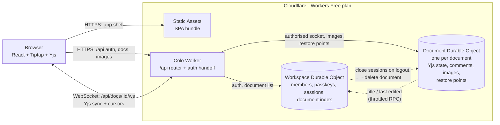

# Colo — Build & Deployment Plan

**Status:** Draft v4.13
**Date:** 20 September 2026
**Owner:** SWC
**Platform:** Cloudflare Workers (Free plan)
**Scale target:** 1–2 monthly active users (personal project)
**Cost target:** $0/month, hard-capped (no payment method on the account); no paid third-party services or add-ons

---

## 0. Revision history

| Version | Date | Change |
|---|---|---|
| v1 | 13 Sep 2026 | First draft on AWS serverless: S3 + CloudFront, Cognito, AppSync, DynamoDB |
| v2 | 13 Sep 2026 | Corrected AWS Free Tier assumptions; shared-workspace access model; app named Colo (commit `40b9942`) |
| v3 | 14 Sep 2026 | **Moved to Cloudflare.** One Durable Object holds all data (SQLite) and the WebSocket hub; invite-only passkey sign-in on `*.workers.dev`. Rationale: [ADR 0001](decisions/0001-move-from-aws-to-cloudflare.md) and [ADR 0002](decisions/0002-passkey-auth-on-workers-dev.md) |
| v3.1 | 15 Sep 2026 | Corrections from building M0: Tailwind CSS v4 + shadcn/ui; `schema_version` table because Durable Object SQLite rejects `PRAGMA user_version`; `@cloudflare/vitest-plugin`; `wrangler.jsonc` keys confirmed against Wrangler 4.131. M0 deployed (commit `5a32431`) |
| v4 | 15 Sep 2026 | **From shared notes to a collaborative document editor in the style of Google Docs.** Tiptap 3 + Yjs; one Document Durable Object per document on `y-partyserver`; real pages, comments, images, restore points, DOCX import/export; new cost model and milestones. Rationale and research: [ADR 0003](decisions/0003-collaborative-document-engine.md) |
| v4.1 | 15 Sep 2026 | **M1 and M2 built** (commits `6daede8`, `8562858`). Corrections: message rate cap is a token bucket of 30/s with bursts of 600 (60 per 10 s cut off fast typists); `doc_meta` deferred — save metadata stays in memory; title changes reach the document list immediately while other edits stay throttled; M2 keeps the strict CSP because nothing in it injects styles (relaxation moves to M3); measured 2 WebSocket messages per keystroke (edit + cursor), as §9.2 assumed |
| v4.2 | 15 Sep 2026 | **M1 and M2 deployed; M2 gate passed** on a temporary `colo-staging` Worker (deleted afterwards): co-editing on Cloudflare; Document objects were evicted and reloaded from SQLite while both sockets stayed open, running no code in between; 238 tokens typed through a redeploy all arrived. The gate found a client bug — the editor unmounted while reconnecting and dropped keystrokes — fixed in `ddd0ae0` |
| v4.3 | 15 Sep 2026 | **M3 built** (commits `e61a77a`…`a038697`): Docs-style shell and full F5 formatting set; CSP `style-src` relaxed as planned. Deviations: the outline reads headings from editor state instead of Tiptap's TableOfContents extension, so it never writes heading IDs into the shared document; paragraph styles are Normal text and Headings 1–4 (no Title/Subtitle); drag handles and UniqueID are deferred until a milestone needs them; the page canvas is Letter-sized without pagination until M4 |
| v4.4 | 15 Sep 2026 | **M3 deployed to production.** Branding added outside the milestone plan (commits `5af4efb`, `aba1f32`, `a483747`): a black wordmark SVG as the in-app logo (document list header, auth cards) and a white variant as the favicon (tab bars are usually dark chrome, so white reads better than black — it is a plain shape with no adaptive background, so it will be invisible on light-themed tab strips); a 1600×400 banner image between the navbar and the document list on the home screen, re-encoded from a 1.46 MB PNG to a ~200 KB WebP (quality 90) with no visible quality loss. No DOCX export exists yet — that is still M7 |
| v4.5 | 16 Sep 2026 | **Home banner has four variants**, all 1600×400 WebP (quality 90, 19–200 KB each) in `src/client/assets/banners/`: the original purple mosaic plus three new sky photos (blue sky, golden hour, night sky). One is chosen at random when the app's JS module first loads and stays fixed for the rest of that load — including navigating away from and back to the document list — and a new one is picked only on an actual browser refresh, since that re-evaluates the module. No server involvement or persistence; purely a client-side cosmetic touch, so it needed no ADR |
| v4.6 | 19 Sep 2026 | **Fixes from a codebase review** (commits `60cc297`, `b7c07e7`): a throttled document-list update lived only in memory, so a Document object evicted before its alarm never reported the last editor — it is now also kept in a `pending_meta` row (§3.2), and `updatedAt` is the time of the last edit; `document_sessions` rows of expired sessions are pruned at sign-in; create and rename update the Document object before the index. Chunked-state storage moved to `src/worker/storage.ts` as §7 intended. Plan corrections: §6.3 listed a `worker-src` directive the code never had (none is needed yet); `document_sessions`' key is `(session_hash, doc_id)`, which suits the per-session delete |
| v4.7 | 19 Sep 2026 | **M4 built** (commits `3ecb61a`, `a931937`). `tiptap-pagination-plus` and `tiptap-table-plus` were not adopted after reading their source — table-plus rewrites whole tables in both browsers and drops cell selection; pagination-plus renders header text as HTML and has no `{total}` — so Colo has its own decoration-only pagination engine using the same float technique, with page geometry computed from the settings ([ADR 0004](decisions/0004-own-pagination-engine.md)). Tables keep Tiptap's schema; tables with vertically merged cells do not split. Default page is A4 with 1-inch margins. Headers and footers are one line of plain text per side |
| v4.8 | 19 Sep 2026 | **M4 deployed to production.** Git history rewritten to remove `Co-Authored-By` trailers from three early commits (the project does not credit Claude in commits); only messages changed — every commit keeps its tree, author and dates — so all commit IDs changed and the IDs quoted in this plan and in ADR 0001 were updated. The old history is kept locally under the tag `pre-rewrite` |
| v4.9 | 19 Sep 2026 | **M5 built** (commits `0d39e67`…`3db4226`), not yet deployed. Each comment is a `Y.Map` inside the thread's `comments` array (not a plain object), so edits, deletes and resolves merge field by field; names are stored with IDs (`createdByName`, `authorName`) because there is no member-list API. Anchoring marks are added and removed outside undo history, and pasted content drops them. Highlights come from a generated stylesheet of open threads, so resolving never touches the text. A comment being written keeps its range as Yjs relative positions. Margin cards need 272 px beside the page; without room (phones, narrow windows) comments live in a panel. Performance: a first version re-rendered every card on each keystroke (400–600 ms with 100 threads); now margin positions are read from the page once a frame and the cards are memoised — production build, 50-page document: 50 threads ≈ 15 ms, 100 threads ≈ 16 ms per keystroke including frame work (`npm run e2e:comments-perf`), 20 threads ≈ 2 ms. "Restore with restore points" moves to M6, which builds restore points |
| v4.10 | 19 Sep 2026 | **M6 built** (commits `e758d4b`…`787ac29`), not yet deployed. **Images:** one SQLite row per image (≤ 1 MB fits under the 2 MB row limit), so the planned `image_chunks` table and width/height columns are dropped; 200 MB of images per document. The browser sends images that already fit (≤ 2048 px, ≤ 1 MB, allowed type) untouched, so screenshots stay sharp and GIFs keep their animation; others become WebP (JPEG where the browser cannot encode WebP). Our own node view instead of Tiptap's resizable one, which ignores remote size changes and never commits touch resizes. Alignment is the paragraph `textAlign` attribute. **Restore points:** `unstable_replaceDocument` only rewinds root types the snapshot already had and treats every root as a map, so a comments map created after a point survived a restore; `replaceState` (`src/worker/restore-points.ts`) uses the same UndoManager approach over the fixed `ROOT_TYPES`. An automatic point is the previously saved state, taken before a save at most every 30 minutes, and never of an empty document. `restore_points` gains `created_by_name`. Document routes for images and restore points are authorised by Workspace (`authorizeRequest`, no writes) and served by the Document object. Also fixed: a session extended on a route other than `/api/me` no longer leaves the browser's cookie behind; a late first `/api/me` no longer signs out a member who has just registered (the intermittent e2e sign-in failure); connection notices clear themselves |
| v4.11 | 19 Sep 2026 | **M6 review** (commits `696ee16`, `318a737`). Ctrl+Alt+M on a selected image no longer starts a comment that could never be anchored (the `comment` mark only applies to text). IDs are now monotonic ULIDs: ones made in the same millisecond used to sort randomly, which made "newest first" and "drop the oldest" unreliable for restore points saved close together. Pruning always keeps the point just saved, so a pre-restore copy survives even when 50 named points exist. Docs brought up to date: stack, repository layout, image nodes in §3.3, image limits in §4.3 and §10 |
| v4.12 | 20 Sep 2026 | **M5 and M6 deployed. M7 built** (commits `ca0b81a`…`70e4ccc`), not yet deployed. Import and export, going beyond DOCX to what Google Docs offers within Colo's limits: open Word, Markdown, web page and text files; download Word, PDF (print), web page, Markdown and text. **Our own DOCX reader instead of `mammoth`** ([ADR 0005](decisions/0005-own-docx-reader.md)): mammoth drops fonts, colours, sizes, alignment, headers, footers and page setup by design. The reader (fflate + DOMParser) resolves Word's style inheritance and reads lists, merged table cells, images, links, fields, page setup, header/footer page numbers and comment threads with replies and resolved state; tracked changes are accepted, footnotes become a Notes list, and an import report lists every conversion and loss. `docx` writes exports with Colo's look as Word styles, and the reader leaves formatting equal to that look unmarked, so a document round-trips unchanged. Converters load on first use (a separate ~140 KB gzipped chunk). File → Replace with file saves an `import` restore point first. Also fixed: headings are limited to the four levels the editor offers (pasted h5/h6 showed as unstyled "Normal text") |

| v4.13 | 20 Sep 2026 | **M7 deployed. M8 backups built** (commits `72273f4`…`ea0195a`). The repository is now public at `github.com/manan-vala/colo`. Backup and restore as NDJSON, one record per line (§8.5): the Yjs state keeps the 1.9 MB chunking it is stored with, so neither object holds a whole document in memory, and a trailing `end` record is the only way to tell a complete backup from a truncated one. Images are included — they are SQLite rows, not part of the Yjs state, so a state-only backup would have restored with every image broken. **Document ids are preserved, never reminted**, because an image's `src` embeds its document id. Passkeys and sessions are never exported: bound to the relying party and to a device, so unusable elsewhere, and a liability in a downloaded file. Restore lives behind `requireAdmin`, which 404s while `ADMIN_TOKEN` is unset, so the destructive route does not exist in production. Two things found while building: committing a restore had to reset the document's metadata flags, or the debounced save that follows would stamp every restored document as edited just now (`replaceState` looks like an edit to the update observer, and a restored title pushes immediately); and guarding the export with `Origin` broke the browser, which omits it on same-origin GETs — `Sec-Fetch-Site` is the header for that. Deviation from §4.1: the export is streamed NDJSON rather than one JSON object, and carries images |

Earlier designs remain readable in git history.

---

## 1. What we are building

**Colo** is a private, browser-based document editor for two people. Both sign in with their own passkeys, see a shared set of documents, and edit them at the same time — typing in the same paragraph, seeing each other's cursors, leaving comments — in a paged layout that looks and works like Google Docs.

Everything runs on Cloudflare's Workers Free plan with no payment method attached, so the monthly bill is $0 by construction. If a daily free limit is ever exceeded, requests fail until the limits reset at 00:00 UTC (05:30 IST) instead of costing money (§9). Every library is open source and self-hosted; nothing is sent to third-party services.

### 1.1 In scope

| # | Capability | Notes |
|---|---|---|
| F1 | Passkey sign-in, invite-only | No passwords; one-time invite links; no public registration (unchanged from v3) |
| F2 | Document list | Newest first, filter by title, "last edited by X" |
| F3 | Create, rename, delete documents | Soft delete (recoverable) |
| F4 | Simultaneous editing | Character-level merging with Yjs; live cursors with names; who is in the document |
| F5 | Rich formatting | Headings and styles, fonts and sizes, bold/italic/underline/strikethrough, text colour and highlight, links, alignment, bulleted/numbered/check lists, indentation, tables, horizontal rules, undo/redo of your own edits |
| F6 | Real pages | A4 or Letter pages with margins, headers and footers, page numbers, tables split across pages; print or save as PDF |
| F7 | Comments | Threads on selected text, replies, resolve and reopen, comments margin |
| F8 | Images | Upload or paste; compressed in the browser and stored with the document |
| F9 | Restore points | Automatic and named snapshots of a document; restore any of them |
| F10 | Import and export | Open a Word (.docx), Markdown, web page or text file as a new document, or replace a document with one; download any document as Word, PDF, web page, Markdown or text. An import report lists what was converted or left out |
| F11 | Outline | Heading-based navigation panel |
| F12 | Save status | "Saving…", "All changes saved", "Offline — changes will sync" |
| F13 | Mobile browser | Continuous (unpaged) layout and a compact toolbar on narrow screens |
| F14 | Backup export | Member-only download of all documents |

### 1.2 Out of scope (for now)

Suggesting mode (track changes), full-text search across documents, offline-first editing, folders or tags, per-document sharing or roles, sharing outside the two-person pool, @mentions and notifications, PDF import, Word-identical layout fidelity, and a custom domain. Each is a deliberate deferral; see §12.

### 1.3 Honest limits of the approach

- **Pages are a visual layout, not a word-processor layout engine.** They look like A4 pages and print as pages, but a DOCX exported from Colo and opened in Word will not be pixel-identical, and vice versa.
- **Several Google Docs features are built by us** (comments, DOCX conversion, restore points, "Page X of Y"), because the ready-made versions in the editor ecosystem are paid (ADR 0003).
- **Mobile is the weakest platform** for rich-text editing in any browser editor; expect rough edges with some Android keyboards.

---

## 2. Architecture



Everything is served from one hostname, `colo.manan-vala.workers.dev`, so there is no CORS and the session cookie is first-party.

### 2.1 Component responsibilities

| Component | Responsibility | Why this one |
|---|---|---|
| **Workers Static Assets** | Serves the built SPA, SPA routing fallback, `_headers` for cache and security headers | Free and unlimited; static requests never invoke the Worker |
| **Colo Worker** | Routes `/api/*`. For document routes, asks Workspace to authorise the session, then forwards to that document's Durable Object with the member's identity in a header it controls. Adds security headers | Stays tiny, so the Free plan's 10 ms CPU limit never matters (waiting on Durable Object calls is not CPU time) |
| **Workspace Durable Object** (one, named `default`) | Members, passkeys, invites, sessions, auth challenges; the document index (title, created, last edited, deleted); which sessions have which documents open, for revocation | One small database for identity and the list; unchanged from v3 for auth |
| **Document Durable Object** (one per document, named by document ID) | The live Yjs document and its WebSockets (via `y-partyserver`, hibernating); saves the Yjs state to its SQLite; images; restore points; enforces message size and rate caps | Each document's memory, storage and CPU are isolated; the proven `y-partyserver` library does the sync protocol |
| **Workers Logs** | Request and exception logs | Free: 200,000 events/day, 3-day retention |
| **Workers Builds** (M8) | Build and deploy on push to GitHub | Free: 3,000 build minutes/month |

### 2.2 Key design choices

**Yjs instead of save-and-broadcast.** Yjs is a CRDT: every keystroke becomes a small update that merges deterministically on every client, so two people typing in the same sentence never lose characters and no conflict banner is needed. The server relays updates and keeps the merged state.

**One Durable Object per document rather than one for everything.** A single object would hold every open document in one isolate's memory and serialise all of them on one thread. Per-document objects isolate a large or busy document, let us use `y-partyserver` (built for one document per object), and cost nothing extra while idle because hibernating objects are not billed for duration. The price is a cross-object authorisation step on connect and throttled metadata updates to Workspace.

**Whole-state saves on a debounce.** Instead of appending every update as a row (which would spend the 100,000 rows/day budget on keystrokes), the Document object writes the complete Yjs state as one row (chunked above 1.9 MB) at most every 2–10 seconds. The spike measured one row written per save regardless of edit count (ADR 0003). If the object dies before a save, connected clients re-send the missing edits when they reconnect — verified in the same spike.

**Comments inside the Yjs document.** Thread data lives in a `Y.Map` next to the content, anchored by a `comment` mark on the text. Comments therefore sync, persist, travel with edited text and appear in restore points with no extra protocol.

**Browser-side conversion.** Import and export run in the browser with open-source libraries, so they cost no Worker CPU and need no server-side document model. The converters load only when someone imports or downloads ([ADR 0005](decisions/0005-own-docx-reader.md)).

**Why not D1 or R2.** Durable Objects already carry SQLite, so D1 would add a second service without benefit. R2 has a free tier but requires adding a payment method to the account, which would end the $0 hard cap; images are small enough to store in the Document object's SQLite (§3.2).

### 2.3 Key request flows

**App load.** Static Assets serve the SPA → `GET /api/me` → `401` shows sign-in; `200` shows the document list from `GET /api/docs`.

**Invite, registration, sign-in, sign-out.** As in v3 (§5): one-time invite links in the URL fragment, WebAuthn registration and discoverable-credential sign-in, hashed session cookie.

**Open a document.**
1. SPA opens `wss://…/api/docs/<id>/ws` through `y-partyserver`'s client provider.
2. Worker checks `Origin`, then calls Workspace `authorizeDocument(cookie, docId)`: session valid, member enabled, document exists and is not deleted. Workspace records `(docId, session)` for revocation and returns the member's ID, name, colour and session expiry.
3. Worker forwards the upgrade to `DOCUMENT.getByName(docId, { locationHint: "apac" })`, replacing any client-supplied `x-colo-member` header with the authorised identity.
4. The Document object accepts the socket as hibernatable, stores `{memberId, sessionHash, sessionExpiresAt}` in the connection state, loads the Yjs state from SQLite if it is not in memory, and runs the Yjs sync handshake. Cursors and names flow through Yjs awareness.

**Editing.** Each local change is sent as a Yjs update and relayed to the other sockets. The object saves the merged state 2 s after edits pause, and at least every 10 s during continuous typing. It pushes `title`, `updatedAt` and `updatedBy` to Workspace for the document list — immediately when the title changed, otherwise at most once a minute. A deferred update is also written to a `pending_meta` row, so an object evicted before its alarm still delivers it.

**Disconnect, deploy, crash.** The provider reconnects with backoff and re-syncs; any edits the server lost are re-sent from the client. Deploys restart objects, so this path runs routinely.

**Hidden tabs.** A tab hidden for 5 minutes disconnects and reconnects when shown again, so forgotten tabs do not keep objects awake (§9.3).

**Sign-out and revocation.** Logout (or disabling a member) makes Workspace call `closeSession(sessionHash)` on every Document object recorded for that session; each closes the matching sockets. Sockets also close themselves at `sessionExpiresAt` on their next message.

**Delete a document.** Workspace soft-deletes the row and calls `closeAll("deleted")` on the Document object; new connections are refused at authorisation.

**Images.** The browser resizes (longest side ≤ 2048 px) and encodes WebP (≤ 1 MB; JPEG where the browser cannot encode WebP; images that already fit are sent untouched), `POST`s it to `/api/docs/<id>/images`, and inserts an image node pointing at the returned URL where the image was added (kept as a Yjs relative position during the upload). The Worker asks Workspace to authorise the session (`authorizeRequest`, which writes nothing) and forwards the request to the Document object with the member's identity. `GET` requests are served by the Document object with `Cache-Control: private, max-age=31536000, immutable`.

**Restore a point.** The object saves a `pre-restore` point of the current state, then rewinds the live document to the snapshot with `replaceState` (the approach of `y-partyserver`'s `unstable_replaceDocument`, extended to every root type in `ROOT_TYPES`). It is applied as a normal change, so every client receives it and nobody's undo can revert it. The object saves at once and broadcasts `restored` with who did it.

**Import.**
1. The browser reads the file with Colo's own DOCX reader (fflate and DOMParser; ADR 0005), or with `marked` and the editor schema for Markdown, the editor schema for HTML, or one paragraph per line for text.
2. It creates the document with the file's title and uploads its images to it.
3. The document screen applies the content outside undo history, then page setup, title and comment threads, and shows the import report.

"Replace with file" first saves an `import` restore point.

**Export.** The browser serialises the editor's JSON, fetches the document's images (WebP becomes PNG for Word) and downloads the file:
- **Word:** written with `docx`, including page setup, header/footer text with page-number fields, images, tables and comment threads.
- **Web page:** standalone, with the images embedded.
- **Markdown** and **text**.
- **PDF:** printing, which already draws one sheet per page.

---

## 3. Data model

### 3.1 Workspace Durable Object (SQLite)

Auth tables are unchanged from v3: `members`, `passkeys`, `invites`, `sessions`, `auth_challenges` (see git history for v3.1 §3.1). Added:

```sql
CREATE TABLE documents (
  id            TEXT PRIMARY KEY,                -- ULID; also the Document Durable Object name
  title         TEXT NOT NULL,
  created_at    TEXT NOT NULL,
  created_by    TEXT NOT NULL REFERENCES members(id),
  updated_at    TEXT NOT NULL,
  updated_by    TEXT NOT NULL REFERENCES members(id),
  deleted_at    TEXT
);
CREATE INDEX documents_live_by_updated ON documents(deleted_at, updated_at);

CREATE TABLE document_sessions (                 -- which sessions opened which documents (revocation fan-out)
  doc_id        TEXT NOT NULL,
  session_hash  TEXT NOT NULL,
  connected_at  TEXT NOT NULL,
  PRIMARY KEY (session_hash, doc_id)             -- logout deletes by session
) WITHOUT ROWID;
```

Rows of sessions that expired rather than signed out are pruned at the next sign-in.

### 3.2 Document Durable Object (SQLite, one database per document)

```sql
CREATE TABLE doc_state (                         -- Y.encodeStateAsUpdate(doc), split into chunks
  seq           INTEGER PRIMARY KEY,
  data          BLOB NOT NULL                    -- ≤ 1.9 MB (row limit is 2 MB)
);

CREATE TABLE pending_meta (                      -- a throttled document-list update awaiting its alarm
  id            INTEGER PRIMARY KEY CHECK (id = 1),
  updated_at    TEXT NOT NULL,
  updated_by    TEXT
);

CREATE TABLE images (                           -- one row per image: at most 1 MB, under the row limit
  id            TEXT PRIMARY KEY,                -- ULID
  mime          TEXT NOT NULL CHECK (mime IN ('image/webp', 'image/png', 'image/jpeg', 'image/gif')),
  bytes         INTEGER NOT NULL,
  data          BLOB NOT NULL,
  created_at    TEXT NOT NULL,
  created_by    TEXT NOT NULL
) WITHOUT ROWID;

CREATE TABLE restore_points (
  id              TEXT PRIMARY KEY,              -- ULID
  kind            TEXT NOT NULL CHECK (kind IN ('auto', 'named', 'pre-restore', 'import')),
  label           TEXT,
  created_at      TEXT NOT NULL,
  created_by      TEXT,                          -- null for automatic points
  created_by_name TEXT,                          -- the Document object has no member list
  state_bytes     INTEGER NOT NULL
) WITHOUT ROWID;
CREATE TABLE restore_point_chunks (              -- the Yjs state, chunked like doc_state
  point_id        TEXT NOT NULL REFERENCES restore_points(id),
  seq             INTEGER NOT NULL,
  data            BLOB NOT NULL,
  PRIMARY KEY (point_id, seq)
) WITHOUT ROWID;
```

`doc_state` ships in M2, `pending_meta` in v4.6, `images` (migration 3) and `restore_points` (migration 4) in M6. An upload writes one row; a restore point one row plus one per 1.9 MB of state, and at most 50 are kept per document (automatic and pre-restore points are dropped before named ones). Images are never deleted, so undo and every restore point keep working. A save upserts the state chunks and deletes chunks beyond the new count, all in one `transactionSync()`, so a save costs exactly one row for documents under 1.9 MB. The metadata throttle is in memory while the object is awake; `pending_meta` is written only when an update is deferred or its editor changes, and deleted once sent — about three rows per minute of editing. `WITHOUT ROWID` tables keep their primary key as the table itself, so chunk writes add no index rows.

### 3.3 Inside the Yjs document

| Shared type | Contents |
|---|---|
| `content` (`Y.XmlFragment`) | The Tiptap/ProseMirror document |
| `settings` (`Y.Map`) | `title`, `pageSize` (`A4` \| `LETTER`), `orientation` (`portrait` \| `landscape`), `margins` (mm), `header` and `footer` (`{ left, right }` plain text with `{page}` / `{total}`), `pagination` on/off. A missing key means the default (A4 portrait, 25.4 mm margins, no header or footer, pages on); malformed values fall back to defaults (`readPageSettings` in `src/shared/doc-schema.ts`) |
| `comments` (`Y.Map`) | `threadId → Y.Map { quote, createdAt, createdBy, createdByName, resolvedAt, resolvedBy, resolvedByName, comments: Y.Array<Y.Map { id, authorId, authorName, body, createdAt, editedAt, deletedAt }> }`. The first comment starts the thread; deleting it deletes the thread. Deleted replies keep their place with an empty body. Readers skip malformed entries (`src/client/comments/model.ts`) |

Images are block `image` nodes in `content` with `src` (always a Colo path, `/api/docs/<id>/images/<imageId>`), `alt`, `width` and `height` (the displayed size, which also reserves the space before the image loads) and `textAlign`; the bytes live in the Document object's `images` table, never in Yjs.

Comment anchors are a `comment` mark with a `threadId` attribute (overlapping marks allowed; y-prosemirror stores them under hashed attribute names). A thread whose anchor text was deleted is shown as "detached" in the comments panel rather than lost; undoing the deletion re-attaches it.

### 3.4 Migrations

Both object classes run pending migrations in `ctx.blockConcurrencyWhile()` from their constructors, using the `schema_version` table and `migrate()` in `src/worker/db.ts` built in M0. Migrations are forward-only and additive so that `wrangler rollback` keeps working. The Yjs document structure is versioned separately: a `settings.schema` number will be introduced the first time a structure change needs an upgrade on load (none has yet — new settings use defaults when absent).

### 3.5 Storage and row budget

Text documents are tens to hundreds of kilobytes of Yjs state; images are capped at 1 MB each. Storage per object is 10 GB, and the Free plan caps the account at 5 GB. Row costs per operation are in §9.2.

---

## 4. API design

### 4.1 HTTP endpoints

| Method and path | Handled by | Auth | Purpose |
|---|---|---|---|
| `GET /api/health` | Workspace | None | Liveness: `{ ok, schemaVersion, colo }` |
| `GET /api/me` | Workspace | Session | Current member; `401` if not signed in |
| `POST /api/admin/invites` | Workspace | `ADMIN_TOKEN` | One-time invite link; `404` when the secret is unset |
| `POST /api/auth/register/options`, `/register/verify`, `/login/options`, `/login/verify`, `/logout` | Workspace | As in v3 | Passkey ceremonies, session cookie |
| `GET /api/docs` | Workspace | Session | Live documents, newest first |
| `POST /api/docs` | Workspace | Session | Create; body `{ title? }` |
| `PATCH /api/docs/:id` | Workspace → Document | Session | Rename from the list page (applied to `settings.title` in the Yjs document) |
| `DELETE /api/docs/:id` | Workspace → Document | Session | Soft delete; closes open sockets |
| `GET /api/docs/:id/ws` | Worker → Document | Session (checked by Workspace) | WebSocket upgrade |
| `POST /api/docs/:id/images` | Worker → Document | Session (checked by Workspace) | Upload one image: raw body, `Content-Type` webp/png/jpeg/gif, ≤ 1 MB; `201 { id, url }` |
| `GET /api/docs/:id/images/:imageId` | Worker → Document | Session (checked by Workspace) | Image bytes, `Cache-Control: private, max-age=31536000, immutable` |
| `GET /api/docs/:id/restore-points` | Worker → Document | Session (checked by Workspace) | `{ points }`, newest first |
| `POST /api/docs/:id/restore-points` | Worker → Document | Session (checked by Workspace) | Create a restore point; body `{ label, kind? }` (1–100 characters; `kind` is `named` by default, or `import` before a file replaces the document) |
| `POST /api/docs/:id/restore-points/:pointId/restore` | Worker → Document | Session (checked by Workspace) | Restore; saves a `pre-restore` point first; returns `{ restored, saved }` |
| `GET /api/export` | Workspace → Documents | Session | Backup as NDJSON (§8.5): members, the document index including soft-deleted rows, and each document's Yjs state and images (base64). Streamed, `Content-Disposition: attachment` |
| `POST /api/admin/restore` | Workspace → Documents | `ADMIN_TOKEN` | Applies one NDJSON batch of a backup; `?overwrite=1` to write over documents that are already there. `404` when the secret is unset, so it does not exist in production |

Every `POST`, `PATCH`, `DELETE` and WebSocket upgrade must carry an `Origin` header equal to `ORIGIN`; anything else gets `403`. `GET /api/export` is additionally checked with `Sec-Fetch-Site`, because browsers omit `Origin` on same-origin GETs: a cross-site fetch or embed is refused, while a same-origin one and a request from a script (which sends neither header, so is not a browser being steered by someone else's page) pass. For document routes, the Worker strips any incoming `x-colo-member` header and sets it only after Workspace authorises the request. Durable Objects are not reachable from the internet except through the Worker.

### 4.2 WebSocket protocol

The document socket speaks the standard Yjs protocols, as implemented by `y-partyserver`:

| Channel | Direction | Use |
|---|---|---|
| Sync (type 0) | Both | Sync step 1/2 on connect, then incremental document updates |
| Awareness (type 1) | Both | Cursor position, selection, name, colour; clients renew every 15 s |
| Custom strings (`__YPS:` prefix) | Server → client | JSON control events: `session-expired`, `document-deleted`, `restored` (by whom), `limit` (`MESSAGE_TOO_LARGE`, `RATE_LIMITED`, `DOCUMENT_TOO_LARGE`) |

### 4.3 Authorisation and limits

- **Trust model.** Every member can read and edit every document (D7). Comment authorship and cursor names are set by clients from `/api/me` and are not cryptographically enforced; this is acceptable for two trusted people, and the server-side identity in each connection is used for logs, restore points and metadata.
- **Session checks.** Checked by Workspace on connect; afterwards the connection state carries `sessionExpiresAt`, and the object closes the socket with code `4001` on the first message after expiry. Logout and disabling a member close sockets immediately (§2.3).
- **Caps (per connection, enforced in the Document object before Yjs processing).**
  - Message size ≤ 1 MB (images use HTTP, not Yjs).
  - A token bucket of 30 messages per second with bursts of 600; the counter lives in the socket attachment so it survives hibernation. Exceeding it closes the socket (code 4008) so the client reconnects and re-syncs instead of silently losing an edit.
  - Document state ≤ 25 MB; beyond that the document becomes read-only with a `DOCUMENT_TOO_LARGE` notice.
- **Image validation.** The object checks the file signature matches the declared type and rejects SVG (script risk). One image ≤ 1 MB; ≤ 200 MB of images per document. Pasted HTML keeps only images whose `src` is a Colo image path, so a document never loads third-party images (the CSP's `img-src 'self'` blocks them anyway).

---

## 5. Authentication design

Unchanged from v3 ([ADR 0002](decisions/0002-passkey-auth-on-workers-dev.md)): invite-only passkeys with `@simplewebauthn/server` (M1 spike confirms it runs in workerd; WebCrypto fallback), discoverable credentials, user verification required, `__Host-colo_session` cookie with a 30-day sliding expiry stored as a SHA-256 hash, `Origin` checks, and an `ADMIN_TOKEN` secret deleted after both users enrol. Relying party ID `colo.manan-vala.workers.dev`; passkeys are bound to that hostname.

Added in v4: document socket authorisation through Workspace, the `document_sessions` revocation fan-out, and session expiry enforcement inside Document objects (§2.3, §4.3).

---

## 6. Frontend

### 6.1 Stack

| Choice | Selection | Rationale |
|---|---|---|
| Framework | React 19 + TypeScript | Matches Tiptap's React bindings |
| Build tool | Vite 8 + `@cloudflare/vite-plugin` | Runs the Worker and both Durable Object classes in workerd during `npm run dev` |
| UI components | Tailwind CSS v4 + shadcn/ui (Radix, Nova preset) | Menus, dropdowns, popovers, dialogs, sheets and tooltips for a Docs-style shell |
| Editor | Tiptap 3 (MIT): StarterKit (links limited to http/https/mailto/tel; Tiptap's own undo/redo disabled), Collaboration, CollaborationCaret, TextStyleKit (font family, size, colour), Highlight (multicolour), TextAlign, TaskList/TaskItem, TableKit (resizable, with Colo's `PagedTableView`), Subscript/Superscript, Placeholder, Image (with Colo's own node view), plus Colo's Indent, DocsFormatting, PageBreak and Pagination extensions | Headless, so the UI is ours; most widely used Yjs binding; all listed extensions are MIT |
| Real pages | Colo's own engine, `src/client/editor/pages/` ([ADR 0004](decisions/0004-own-pagination-engine.md)) | Decoration-only, so safe with Yjs; margin bands are floats placed from computed page geometry; table rows are separate grids so tables split between rows |
| Collaboration client | `yjs` + `y-partyserver/provider` | Reconnect, resync and awareness handled by the library |
| Comments | Our code, `src/client/comments/`: `comment` mark + `Y.Map` threads + margin cards and a comments panel | Tiptap Comments is paid |
| Images | Our code, `src/client/editor/images/`: canvas compression in the browser, upload, a resizable node view | Tiptap's resizable image view ignores the other person's size changes and never commits touch resizes |
| Restore points | Our code, `src/worker/restore-points.ts` and `src/client/doc/RestorePointsDialog.tsx` | Tiptap's version history is paid |
| Import and export | Our DOCX reader on `fflate` + DOMParser; `docx` (export); `marked` (Markdown import); our Markdown, HTML and text writers — `src/client/convert/` ([ADR 0005](decisions/0005-own-docx-reader.md)) | Open source, browser-side, loaded on first use; mammoth drops most visual formatting |
| Auth | `@simplewebauthn/browser` | Passkey prompts |
| Fonts | Self-hosted via `@fontsource` (OFL): Arimo (shown as Arial), Carlito (Calibri), Caladea (Cambria), Cousine (Courier New), Tinos (Times New Roman); Geist for the UI | No font CDN (CSP, privacy); metric-compatible, so DOCX layout stays close |
| Tests | Vitest 4.1 + `@cloudflare/vitest-plugin`; puppeteer-core with the local Chrome for two-browser tests (`e2e/`) | Real Durable Objects and SQLite in tests; headless checks of pagination, print and sync |

### 6.2 Layout (Google Docs–style, Colo branding)

- **Home:** document list (title, last edited by and when), title filter, "New document", "Import file".
- **Document top bar:** home link, editable title, save status, avatars of people in the document, comments toggle.
- **Menu bar:** File (new, open file, replace with file, download as Word / PDF / web page / Markdown / text, restore points, page setup, print), Edit (undo, redo), Insert (image, table, link, page break, horizontal line, comment), Format (text styles, alignment, lists, clear formatting).
- **Toolbar:** undo, redo, print, zoom, style (Normal/Title/Headings), font, size, bold, italic, underline, strikethrough, text colour, highlight, link, comment, image, alignment, check/bulleted/numbered lists, indent, clear formatting.
- **Canvas:** grey background with white A4/Letter pages, headers, footers and page numbers; outline panel on the left; comment cards aligned to their anchors on the right.
- **Narrow screens:** pagination off (continuous page), compact toolbar in a bottom sheet, comments in a sheet.

### 6.3 Security headers

`public/_headers` for static assets:

```
/*
  Content-Security-Policy: default-src 'self'; script-src 'self'; style-src 'self' 'unsafe-inline'; img-src 'self' data: blob:; font-src 'self'; connect-src 'self'; frame-ancestors 'none'; base-uri 'none'; form-action 'self'
  X-Content-Type-Options: nosniff
  Referrer-Policy: same-origin
  Permissions-Policy: camera=(), microphone=(), geolocation=()

/index.html
  Cache-Control: no-cache

/assets/*
  Cache-Control: public, max-age=31536000, immutable
```

- **`style-src 'unsafe-inline'` is required** because rich-text marks (colour, font, size), table column widths and page geometry render inline styles, and Radix and the print `@page` rule use `<style>` elements. Applied in M3 (`16482a6`). `script-src` stays `'self'`, which also blocks inline event handlers. Tiptap's own injected CSS is disabled (`injectCSS: false`) and shipped as a stylesheet. M2 ran under the strict policy; M3 relaxed `style-src` when formatting arrived.
- **Header/footer text is plain text**, rendered with `textContent`, so a document cannot inject markup through page settings.
- No `worker-src` directive: nothing uses web workers yet (`default-src 'self'` covers same-origin ones). Add `worker-src 'self' blob:` only when a feature needs blob workers.
- `_headers` does not apply to Worker responses, so the Worker adds the same headers to `/api` responses (except `101` upgrades), plus `Cache-Control: no-store` unless the object sets one.

---

## 7. Project structure and configuration

**One npm package, no workspaces.**

```
colo/
  package.json              # scripts: dev, build, preview, test, deploy, cf-typegen, invite
  wrangler.jsonc
  worker-configuration.d.ts # generated by `npm run cf-typegen`; committed
  vite.config.ts            # react + tailwind + cloudflare plugins; @ -> src/client
  vitest.config.ts
  components.json           # shadcn/ui configuration
  tsconfig.json             # references app, worker, node and test projects
  index.html
  public/
    _headers
  src/
    client/
      main.tsx, App.tsx, auth.ts
      components/ui/        # shadcn/ui components
      home/                 # document list, import file
      doc/                  # document shell: top bar, menus, outline, page setup, restore points, print styles
      editor/               # Tiptap setup, extensions, toolbar
        pages/              # pagination engine, page break node, paged table view (M4)
        images/             # image extension, resizable node view, compression, upload (M6)
      comments/             # thread model, comment mark, margin cards, comments panel (M5)
      collab/               # provider, hidden-tab disconnect, save status, page settings, tracked positions
      convert/              # import and export (loaded on first use): docx/ reader and writer,
                            # markdown.ts, html.ts, text.ts, apply.ts (put an import into a document)
      lib/utils.ts
    worker/
      index.ts              # router + auth handoff
      workspace.ts          # Workspace Durable Object
      auth.ts               # invites, passkeys, sessions
      documents.ts          # document index, authorisation, revocation fan-out
      document.ts           # Document Durable Object (y-partyserver YServer)
      storage.ts            # chunked state, pending metadata
      images.ts             # image upload and serving (M6)
      restore-points.ts     # restore points, automatic points, replaceState (M6)
      db.ts                 # migrations
    shared/
      protocol.ts           # HTTP types, control events, limits
      doc-schema.ts         # Yjs document structure and settings types
  scripts/
    invite.ts
  e2e/                      # browser tests (puppeteer-core + Chrome virtual passkeys)
    browser.ts (shared helpers), auth.ts, collab.ts, formatting.ts, pages.ts, comments.ts,
    comments-perf.ts, images.ts, restore-points.ts, convert.ts, gate.ts
  test/                     # Vitest in workerd; convert/ has its own tsconfig (DOM types) and Word fixtures
  docs/
    colo-plan.md
    decisions/
```

**`wrangler.jsonc`** (v4 adds the Document class):

```jsonc
{
  "$schema": "./node_modules/wrangler/config-schema.json",
  "name": "colo",
  "main": "src/worker/index.ts",
  "compatibility_date": "2026-09-01",
  "workers_dev": true,
  "preview_urls": false,
  "assets": {
    "not_found_handling": "single-page-application",
    "run_worker_first": ["/api/*"]
  },
  "durable_objects": {
    "bindings": [
      { "name": "WORKSPACE", "class_name": "Workspace" },
      { "name": "DOCUMENT", "class_name": "Document" }
    ]
  },
  "exports": {
    "Workspace": { "type": "durable-object", "storage": "sqlite" },
    "Document": { "type": "durable-object", "storage": "sqlite" }
  },
  "vars": {
    "RP_ID": "colo.manan-vala.workers.dev",
    "ORIGIN": "https://colo.manan-vala.workers.dev"
  },
  "observability": { "enabled": true, "head_sampling_rate": 1 }
}
```

- **`y-partyserver` peer dependency:** version 2.2.0 declares `@cloudflare/workers-types@^4` while Wrangler 4.131 wants v5. Add an npm `overrides` entry rather than `--legacy-peer-deps`.
- **npm:** `npm ci` works with npm 11; add packages with `npx npm@latest install <pkg>` (npm 11.5 crashes on Vite 8's optional peers).
- Local overrides (`RP_ID=localhost`, `ORIGIN=http://localhost:5173`, a local `ADMIN_TOKEN`) go in `.dev.vars`, which is git-ignored.

---

## 8. Deployment

### 8.1 Prerequisites

- A free Cloudflare account with no payment method.
- Node.js 22+ (`.nvmrc` pins 24). Wrangler is a dev dependency, run via `npx wrangler`.
- A passkey-capable device for each user.
- The `workers.dev` subdomain is fixed (`manan-vala`), and passkeys will be bound to `colo.manan-vala.workers.dev`.

### 8.2 First deployment

Done for M0 on 15 September 2026. From M1 onwards:

```bash
npm run deploy
curl https://colo.manan-vala.workers.dev/api/health

# Admin secret: keep a copy outside the repo (the invite script reads ~/.colo/admin-token)
mkdir -p ~/.colo && openssl rand -base64 32 | tr -d '
' > ~/.colo/admin-token
npx wrangler secret put ADMIN_TOKEN < ~/.colo/admin-token

npm run invite -- --email <email> --name "<name>"   # prints a one-time link valid for 24 h

# After both passkeys are enrolled
npx wrangler secret delete ADMIN_TOKEN
```

### 8.3 Routine deploys

`npm run deploy` uploads the Worker, both Durable Object classes and the static assets as one version. Deploying restarts objects and closes sockets; clients reconnect, re-sync and re-send unsaved edits (§2.3).

### 8.4 CI/CD (M8)

GitHub repository (`github.com/manan-vala/colo`, now public) connected to **Workers Builds**. The configuration lives in the Cloudflare dashboard rather than in the repository, so it is written down here:

| Setting | Value |
|---|---|
| Repository | `manan-vala/colo` |
| Production branch | `main` |
| Build command | `npm ci && npm run ci` |
| Deploy command | `npx wrangler deploy` |
| Root directory | `/` |
| Node version | 24 (`.nvmrc`) |

`npm run ci` is `npm run typecheck && npm test && vite build`. **Order matters:** `npm test` is `vitest run`, which strips types without checking them, so `tsc -b` runs first or a type error surfaces only after a full suite. `vite build` rather than `npm run build`, which would run `tsc -b` a second time.

**`npm ci`, never `npm install`** — npm 11.5 crashes on this project resolving Vite 8's optional peer dependencies.

Verified from a clean clone on 20 Sep 2026: `npm ci` then `npm run ci` passes with no `.dev.vars` present, which is what the build environment will look like. The e2e suites stay out of CI: they need Chrome and a server on port 5173.

Free plan: 3,000 build minutes/month, one concurrent build, 20-minute timeout.

### 8.5 Rollback and restore

- **Code:** `npx wrangler rollback`; additive migrations keep older code working.
- **Documents:** restore points inside each document (F9).
- **Everything:** the `/api/export` backup, below. Durable Object SQLite point-in-time recovery (30 days) may exist on the Free plan — still to verify; until then the backup is the only full copy.

#### Taking a backup (M8)

The account menu on the document list → **Download backup** saves `colo-backup-<date>.ndjson`: one JSON record per line — a header, every member, the document index *including soft-deleted rows* (D8), then each document's Yjs state and its images as base64. The state keeps the 1.9 MB chunking it is stored with (§3.2), so neither Durable Object ever holds a whole document in memory, and the last line is an `end` record, which is the only way to tell a complete backup from a truncated one.

**Passkeys and sessions are never in it.** A passkey is bound to the relying party and to a device, so a restored one could not be used anywhere else, and a live session hash has no business in a file that sits in a Downloads folder. A restored instance therefore needs a fresh invite before anyone can sign in.

**What it cannot include:** edits still inside the 2 s / 10 s save debounce (§9.3), because the export reads SQLite rather than waking each document; and restore points, which are per-document history rather than data.

#### Restoring into a local instance

```bash
# 1. ADMIN_TOKEN must be in .dev.vars, then start the Worker — and do not open the app yet.
npm run dev

# 2. Apply the backup. --overwrite is needed if the instance already has documents.
npm run restore -- --file colo-backup-2026-09-20.ndjson --overwrite

# 3. Passkeys are not restorable, so enrol a fresh one.
npm run invite -- --email <your email> --name "<Your Name>" --local
```

`createInvite` reuses an existing member row by email, so the restored member keeps its id — and therefore its documents' `created_by` and its cursor colour.

Two properties do the safety work:

- **`POST /api/admin/restore` does not exist in production.** It sits behind `requireAdmin`, which answers 404 while `ADMIN_TOKEN` is unset, and production deletes that secret once both passkeys are enrolled (§8.2). The script also refuses a non-localhost target without `--force`.
- **Ids are preserved, never reminted.** An image's `src` embeds its document id (`imagePath`), so a restore that minted new ids would break every image in every document. Every write is an upsert keyed on the id from the backup, so running the same file twice changes nothing and a failed run can simply be repeated. Nothing is ever deleted: rows in the backup win, rows not in it are left alone.

Do not open the app while a restore is running. A document over 1.9 MB arrives as several chunks, and a reader that loads it between them would see a torn state.

**Ceiling to watch:** the export makes one Durable Object subrequest per document. The Workers Free plan caps subrequests per invocation (50 is the documented figure), which would put a ceiling on the number of documents one export can cover. Local dev does not enforce it — an export of 167 documents and 90 MB succeeded — so this is **unverified on the deployed Worker** and should be checked before the workspace grows. If it binds, the fix is to page the export per document rather than fan out from Workspace.

---

## 9. Cost model

### 9.1 Plan

Workers Free plan, no payment method: **$0/month with no way to be charged.** Limits reset daily at 00:00 UTC; exceeding one makes that kind of operation fail until the reset.

### 9.2 Free allowances vs. a heavy day

Assumptions: both people actively type for 3 hours each (about 3 edits per second while typing), and 4 tabs stay open for 12 hours. Measured in the spike: **one WebSocket message per edit** and **one row written per save**. Cursor updates are assumed to add one awareness message per edit.

| Resource | Free allowance | Heavy day | Share |
|---|---|---|---|
| Static asset requests | Unlimited | Any | — |
| Worker requests | 100,000/day; 10 ms CPU | ~1,000–2,000 (page loads, auth, images, socket upgrades) | ~2% |
| Durable Object requests | 100,000/day; incoming WebSocket messages count 20:1; outgoing are free | ~64,800 edits + ~64,800 cursor updates + ~11,500 awareness renewals ≈ 141,000 messages → **~7,100**; plus ~1,000 HTTP/RPC calls | ~8% |
| Durable Object duration | 13,000 GB-s/day; hibernation-eligible idle objects are not billed | Objects active ~6 h in total at 128 MB ≈ **2,800 GB-s** | ~22% |
| SQLite rows written | 100,000/day; deletes and `setAlarm()` count | Saves every 2–10 s while editing ≈ 2,200–10,800; deferred metadata (alarm, `pending_meta` write and delete, ≈ 3 per minute of editing) ≈ 1,100; auto restore points, metadata pushes, sessions ≈ 1,500 → **≤ 13,500** | ≤ 14% |
| SQLite rows read | 5,000,000/day | State reloads after hibernation (~2 rows each), lists, auth → **< 100,000** | < 2% |
| SQLite storage | 5 GB account; 10 GB per object | Text documents: MBs. Images ≤ 1 MB each, ≤ 200 MB per document. Restore points capped at 50 per document | Low |
| Workers Logs | 200,000 events/day | A few thousand (WebSocket messages are not request logs) | Low |

**The one real risk is duration.** If hibernation does not work as expected (for example, a timer keeps objects awake), four documents left open all day would use about 44,000 GB-s — over three times the allowance. That is why hibernation is verified on the deployed Worker in M2 before anything else is built on it, and why hidden tabs disconnect.

### 9.3 Safeguards (required)

1. **Hibernating sockets:** `static options = { hibernate: true }` on the Document object; no timers besides the save debounce; awareness intervals disabled server-side (as `y-partyserver` already does).
2. **Debounced whole-state saves:** 2 s after the last edit, at most 10 s apart; one row per save for documents under 1.9 MB.
3. **Hidden-tab disconnect:** 5 minutes after a tab becomes hidden; reconnect when visible.
4. **Per-connection caps:** 1 MB messages, 30 messages/s sustained with bursts of 600, 25 MB document state (§4.3).
5. **Throttled metadata:** at most one Workspace update per document per minute for ordinary edits (a pending update is kept in `pending_meta` and flushed by an alarm); title changes are sent immediately.
6. **Bounded restore points:** automatic at most every 30 minutes of activity; keep the newest 50 per document.
7. **Images:** compressed in the browser, 1 MB maximum, served with long private caching.
8. **Monitoring:** check Workers and Durable Objects metrics weekly during M2–M4 and monthly afterwards; investigate anything above 50% of a daily limit. Optional client-side cursor throttling if awareness traffic turns out higher than estimated.

---

## 10. Security posture

- **Sign-in and sessions:** as in v3 — invite-only passkeys, hashed revocable sessions, `SameSite=Strict`, `Origin` checks on state changes and upgrades, admin secret removed after enrolment.
- **Document access:** every document route is authorised by Workspace; Durable Objects are only reachable through the Worker; the Worker controls the identity header.
- **Revocation:** logout and member disabling close document sockets across all Document objects.
- **Browser:** CSP with `script-src 'self'` and `frame-ancestors 'none'`; `style-src` allows inline styles (§6.3). Pasted and imported HTML is parsed in an inert document through the editor schema, which drops unknown elements and attributes; imported files never load anything from other sites. DOCX files are limited to 50 MB and 200 MB unzipped, checked before inflating (zip bombs). Header/footer text is escaped. SVG images are rejected, and pasted content keeps only Colo's own images.
- **Abuse limits:** message, rate and document size caps per connection.
- **Data:** encrypted at rest by Cloudflare; restore points per document; `/api/export` backups (§8.5), which carry no passkeys and no sessions, and are refused on a cross-site fetch.
- **No headless read of production.** The export is session-only — it deliberately does *not* accept `ADMIN_TOKEN`, which would have defeated deleting that secret after enrolment — and the restore route is admin-token-only, so it does not exist in production at all. Taking a backup means signing in with a passkey; restoring means having the secret, which production does not.
- **A backup is untrusted input.** Restoring an image re-runs the checks an upload gets: the bytes must match the declared type (so SVG and anything else that can carry script stays out) and the size limits still apply.

**Residual risks:**

- **Authentication code is ours** (v3). Mitigated by SimpleWebAuthn, tests and a focused review in M1.
- **Members are fully trusted.** A member (or a buggy client) can alter any document, comment authorship or cursor names. Mitigated by restore points and the small, known membership.
- **Server cannot validate document structure** cheaply; a corrupt update affects everyone. Mitigated by restore points and the `pre-restore` safety copy.
- **Inline styles are allowed.** CSS injection is limited because document content never becomes raw HTML outside the editor schema.
- **The pagination engine is ours** (ADR 0004). Covered by unit tests of the geometry and the two-browser `e2e:pages` test, including print.
- **The DOCX reader is ours** (ADR 0005). Covered by a Word-made fixture, a write-then-read round trip of every supported feature, and `e2e:convert`, which opens an export in Word.

---

## 11. Build plan

| Milestone | Deliverable | Acceptance checks | Effort |
|---|---|---|---|
| **M0 — Skeleton** ✅ | Vite + React + shadcn; Worker router; Workspace object answering `/api/health`; deployed | Done 15 Sep 2026 (commit `5a32431`) | — |
| **M1 — Passkey auth** ✅ built | SimpleWebAuthn-in-workerd spike (runs without `nodejs_compat`); auth tables; invite, register, login, logout; `scripts/invite.ts`; sign-in and invite screens | Tests with a software authenticator ✅; browser test with Chrome virtual passkeys ✅; deployed ✅; **both users enrolled — pending** | Commit `6daede8` |
| **M2 — Collaboration core** ✅ built | `documents` table and list API; Document object on `y-partyserver` with hibernation, chunked saves, caps; Worker auth handoff and revocation; minimal Tiptap editor with collaboration and cursors; document list, create, rename, delete; hidden-tab disconnect | Local: 44 workerd tests ✅, two-browser co-editing test on the production build under the strict CSP ✅. **Deployed gate ✅ passed 15 Sep 2026 on `colo-staging`** (`npm run e2e:gate`): co-editing; eviction and reload while sockets stay open (`document-load` logs, no events while idle); 238 tokens typed through a redeploy all arrived and persisted. Still to watch: Durable Objects duration in the dashboard during real use | Commits `8562858`, `ddd0ae0` |
| **M3 — Document UI** ✅ built, ✅ deployed | Docs-style shell (title bar, File/Edit/View/Insert/Format menus, toolbar), formatting set (F5), outline, zoom, fonts, save status, mobile layout, CSP change | `npm run e2e:formatting` ✅: every toolbar and menu action reaches the second browser, identical content, no CSP violations, 390px layout without horizontal scroll. Deployed to production 15 Sep 2026 along with logo/favicon/banner branding. **Still pending:** a check on a real phone | Commits `e61a77a`…`a038697`, `5af4efb`, `aba1f32`, `a483747` |
| **M4 — Real pages** ✅ built, ✅ deployed | Pagination with A4/Letter, margins, headers/footers, page numbers including "Page X of Y", table splitting, page breaks, page setup dialog, print stylesheet | `npm run e2e:pages` ✅ on the production build: 52-page document with tables, no line or row inside a margin band, tables split between rows; keystroke + layout median 4–5 ms, p95 7–9 ms; printed PDF has one sheet per page (sheets checked visually against the screen); a page break reflows the other browser exactly; Letter and pageless modes. Deployed to production 19 Sep 2026. **Still pending:** checks on a real phone and a real printer | Commits `3ecb61a`, `a931937` |
| **M5 — Comments** ✅ built, ✅ deployed | Comment mark, thread storage, margin cards, replies, resolve/reopen, detached threads | `npm run e2e:comments` ✅ on the production build: comments, replies, edits and deletes sync live; highlight and card aligned (0 px); overlapping threads; resolve/reopen; detached and re-attached on undo; undo of typing keeps comments; paste does not copy them; a draft survives the other person's edits; no highlights in print; phone panel. Unit tests for the model, anchors, margin layout and highlight CSS. "Restore with restore points" is checked in M6. Deployed 19–20 Sep 2026 | Commits `0d39e67`…`3db4226` |
| **M6 — Images and restore points** ✅ built, ✅ deployed | Upload, paste, resize and alignment of images; automatic and named restore points; restore with `pre-restore` copy | `npm run e2e:images` ✅ and `npm run e2e:restore` ✅ on the production build: picked and pasted images reach the other browser; a 4000×3000 paste is stored as WebP, 0.97 MB, 2048×1536; resizing and centring sync; eight images add ~1.5 KB to the shared document and none crosses a page edge; pasted HTML keeps only Colo's images; images print. A restore brings back the text and its comment and removes the newer comment in both browsers, with a notice; Ctrl+Z does not revert it; the pre-restore copy restores the newer version. Unit tests: image API (types, signatures, limits, a 30-image document), `replaceState`, the restore API with two Yjs clients, automatic points, retention and ID order. **Known limits:** an image pasted from another document still points at that document; images are never deleted. Deployed 19–20 Sep 2026 | Commits `e758d4b`…`787ac29`, review fixes `696ee16`, `318a737` |
| **M7 — Import and export** ✅ built | Import (content, tables, images, page size, margins) and export (content, tables, images, page settings, headers/footers, page numbers, comments); beyond the plan: Markdown, web page and text both ways, PDF via print, replace with file, import report | `npm run e2e:convert` ✅ on the production build: a Word-made file imports with headings, merged cells, image, comment thread with reply, title, Letter landscape and header page numbers in both browsers; its Word export imports back to identical text and opens in Word (checked through COM: table, picture, 3 comments with a reply and a resolved one, header, footer, page setup); Markdown, web page and text downloads; replace with file keeps a restore point. Unit tests: 15 reader tests on the Word fixture and edge cases (field links, unsafe links, equations, EMF, charts, list counting, zip bomb, damaged files), a round trip of every supported feature, Markdown and text. **Known losses** (listed in the import report): line and paragraph spacing, columns, equations, charts and SmartArt, embedded objects, EMF/WMF/TIFF images, first-page/even headers, centred header text; footnotes become a Notes list; tracked changes are accepted; floating images and text boxes go in line. LibreOffice not checked automatically. **Still pending:** deploy | Commits `ca0b81a`…`70e4ccc` |
| **M8 — Hardening** ◐ in progress | `/api/export`; PITR check; security review; Workers Builds CI; metrics review; mobile pass | **Backups ✅ built:** `npm test` covers the format, the SQL and the refusals, including that no passkey or session can ever be written; `npm run e2e:backup` is the acceptance check — a document with text and an image is exported through the account menu (90 MB reached disk), wrecked, restored with `npm run restore`, and comes back with its image still serving from the same URL, which proves the id survived, and without being counted as an edit. **Still to do:** PITR check, security review, Workers Builds CI, metrics review, mobile pass | 2 days |

**Total:** about 17–24 working days after M0.

---

## 12. Open decisions

| # | Decision | Default if undecided |
|---|---|---|
| D1 | Suggesting mode (track changes) | Deferred. Evaluate `@handlewithcare/prosemirror-suggest-changes` (MIT) with Yjs after M7 |
| D2 | Full-text search across documents | Deferred. Would store extracted plain text per document in Workspace |
| D3 | Durable Object location | `locationHint: "apac"` on first creation of every object |
| D4 | Custom domain | Deferred; would cost a registry fee and require re-enrolling passkeys |
| D5 | Offline editing | Deferred. `y-indexeddb` would add offline edits and faster loads; must be cleared on sign-out |
| D6 | Automated off-site backups | Deferred; manual `/api/export`, plus PITR if available on Free |
| D7 | Per-document sharing or roles | Deferred; all members edit all documents |
| D8 | Trash / restore deleted documents UI | Deferred; soft-deleted rows remain and appear in `/api/export` |
| D9 | Staging environment | Deferred; a second Worker would get its own objects and data |
| D10 | Word-faithful layout | Deferred. M4 met its checks with Colo's own engine (ADR 0004); SuperDoc (AGPL-3.0, ~2.7 MB gzip engine, telemetry must be disabled) stays the fallback if Word fidelity becomes a requirement |

---

## 13. Reference — verified service limits

Figures confirmed against Cloudflare documentation in September 2026.

**Workers.** Free: 100,000 requests/day, 10 ms CPU per invocation; exceeding a daily limit makes further operations fail with errors rather than incur charges. Static asset requests are free and unlimited. `_headers` rules do not apply to responses generated by Worker code. Preview URLs are not generated for Workers that implement a Durable Object.

**Durable Objects.** Free plan supports only SQLite-backed objects: 100,000 requests/day, 13,000 GB-s duration/day, 5 million rows read/day, 100,000 rows written/day, 5 GB storage for the account, 10 GB per object, 100 classes per account. Limits reset at 00:00 UTC. Incoming WebSocket messages are billed at 20:1; outgoing messages are free. Objects idle and eligible for hibernation are not billed for duration, even before they are hibernated. Alarms do not count as requests, but each `setAlarm()` counts as a row written; deletes count as rows written; index rows count as additional rows written. Maximum string, BLOB or row size 2 MB; SQL statement 100 KB; 100 columns per table; 100 bound parameters per query. Received WebSocket messages up to 32 MiB; socket attachments up to 16 KiB; CPU per request 30 seconds by default. `PRAGMA user_version` is not authorised (found in M0). SQLite point-in-time recovery covers 30 days (Free-plan availability not stated).

**R2.** Free tier of 10 GB-month storage, 1 million Class A and 10 million Class B operations per month with free egress, but enabling R2 requires adding a payment method — not used by Colo.

**Workers Logs.** Free: 200,000 log events/day, 3-day retention.

**Workers Builds.** Free: 3,000 build minutes/month, one concurrent build, 20-minute timeout.

---

## Sources

- [Cloudflare Workers pricing](https://developers.cloudflare.com/workers/platform/pricing/)
- [Durable Objects pricing](https://developers.cloudflare.com/durable-objects/platform/pricing/)
- [Durable Objects limits](https://developers.cloudflare.com/durable-objects/platform/limits/)
- [Durable Objects SQLite storage API](https://developers.cloudflare.com/durable-objects/api/sqlite-storage-api/)
- [Durable Objects WebSocket best practices](https://developers.cloudflare.com/durable-objects/best-practices/websockets/)
- [Durable Objects migrations and exports](https://developers.cloudflare.com/durable-objects/reference/durable-objects-migrations/)
- [Workers Static Assets headers](https://developers.cloudflare.com/workers/static-assets/headers/)
- [Workers Static Assets SPA routing](https://developers.cloudflare.com/workers/static-assets/routing/single-page-application/)
- [R2 pricing](https://developers.cloudflare.com/r2/pricing/) and [community report on the R2 payment-method requirement](https://community.cloudflare.com/t/if-i-want-to-use-cloudflare-r2-i-have-to-link-a-payment-method-i-suggest-not-doin/887578)
- [PartyKit / y-partyserver](https://github.com/cloudflare/partykit/tree/main/packages/y-partyserver)
- [Tiptap pricing](https://tiptap.dev/pricing) and [Tiptap open-sourcing formerly Pro extensions](https://tiptap.dev/blog/release-notes/were-open-sourcing-more-of-tiptap)
- [tiptap-pagination-plus](https://github.com/RomikMakavana/tiptap-pagination-plus) (studied, not used — ADR 0004)
- [CKEditor 5 licensing](https://ckeditor.com/docs/ckeditor5/latest/getting-started/licensing/license-and-legal.html)
- [Plate Yjs](https://platejs.org/docs/yjs), [Plate comments](https://platejs.org/docs/comment), [Plate pagination discussion](https://github.com/udecode/plate/discussions/4380)
- [BlockNote comments](https://www.blocknotejs.org/docs/features/collaboration/comments) and [DOCX export licensing](https://www.blocknotejs.org/docs/features/export/docx)
- [SuperDoc](https://github.com/superdoc-dev/superdoc)
- [docx](https://github.com/dolanmiu/docx), [fflate](https://github.com/101arrowz/fflate), [marked](https://github.com/markedjs/marked), [mammoth](https://github.com/mwilliamson/mammoth.js) (studied, not used — ADR 0005)
- [eigenpal docx-js-editor](https://github.com/eigenpal/docx-js-editor)
- [SimpleWebAuthn server](https://simplewebauthn.dev/docs/packages/server)
